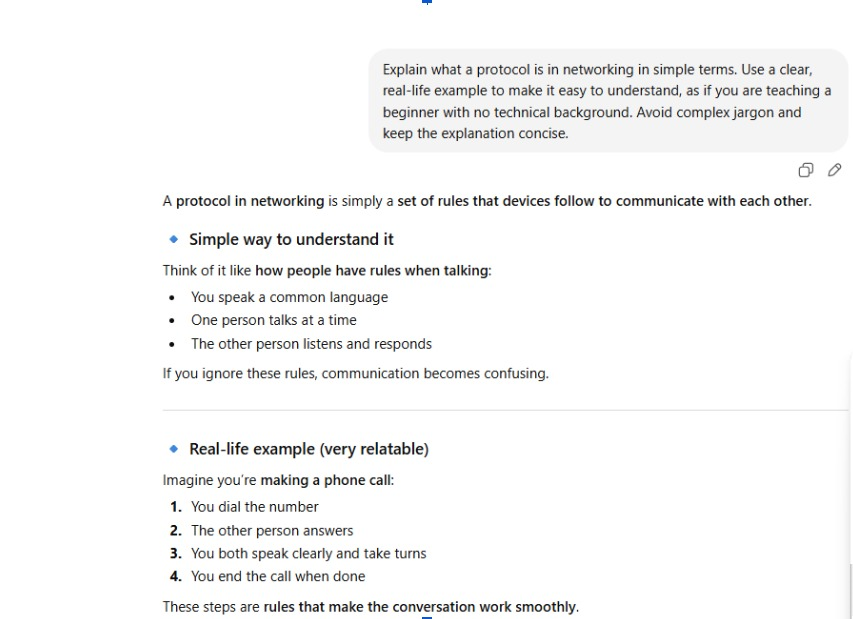
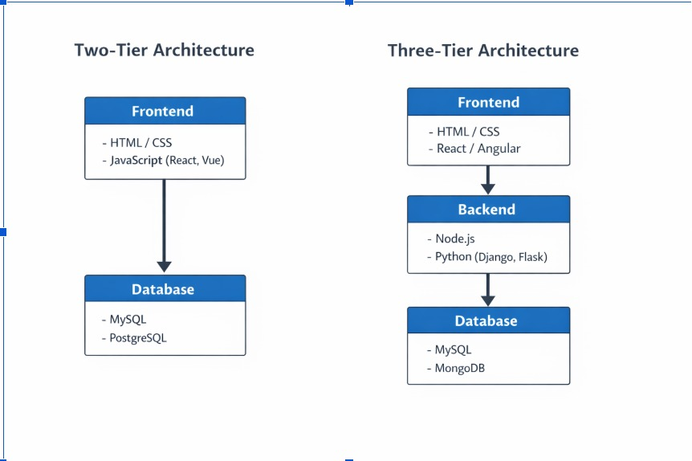
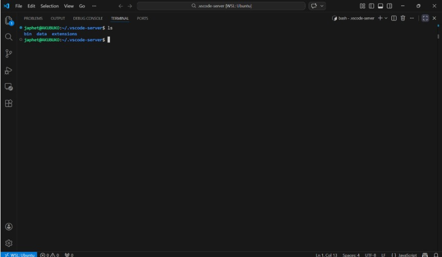

# Week 00 - Internet and Networking

Part of the DevOps Micro Internship (DMI) Cohort 3 with Agentic AI

---

# 🧑‍💻 Task 1: Using ChatGPT as Your Learning Assistant

## Scenario

You're new to DevOps and will frequently encounter technical questions. ChatGPT can be your learning companion.

## Your Task

Write a clear ChatGPT prompt to help you understand:

> "What is a protocol in networking? Explain with a simple real-life example."

Take a screenshot of your interaction showing:

* Your detailed prompt (with clear expectations)
* ChatGPT's simplified response with an example

## Screenshot

Save your screenshot in the `screenshots` folder and update the file name below.




Replace `task-1-chatgpt.png` with your actual screenshot file name.

---

## What I Learned (2–3 lines)

From this task, I learned that a protocol in networking is a set of rules that enables smooth communication between devices. I also realized the importance of using ChatGPT, as it helped simplify the concept, provide clear examples, and made it easier to understand and complete the task efficiently.


---

# 🌐 Task 2: Internet and Networking

## Scenario

Your friend is launching an online bookstore named **EpicReads**.

He asked you to explain how users globally can access his website hosted in Finland.

## Your Task

Write a short explanation (**100–150 words**) that includes:

* Packet Switching
* IP Address
* TCP/IP
* HTTP/HTTPS

💡 **Tip:** You may use ChatGPT (as demonstrated in Task 1) to refine your explanation.

## Answer

When someone anywhere in the world tries to visit EpicReads, their device sends a request over the internet. Every website has an “IP address”, which works like a home address, helping the request find the server in Finland. The data does not travel in one piece; it is broken into small parts through “packet switching”, so it can move faster across different routes. These packets follow rules called “TCP/IP”, which ensure the data is sent correctly, arrives complete, and is arranged in the right order. Finally, “HTTP or HTTPS” is used to display the website in the user’s browser, allowing them to view and interact with the online bookstore securely.


---

# 🏗️ Task 3: Application Architecture & Stack

## Scenario

EpicReads bookstore has two application versions:

### Two-Tier Application

* Frontend
* Database

### Three-Tier Application

* Frontend
* Backend
* Database

## Your Task

* Draw simple diagrams (hand-drawn or tool-based such as draw.io)
* Label each layer clearly
* List at least two common technologies or tools used for each layer
* Submit a screenshot or photo clearly showing your own drawing

## Diagram Screenshot / Photo

Save your diagram image in the `screenshots` folder and update the file name below.




Replace `task-3-diagram.png` with your actual diagram file name.

---

## Technologies Used

### Frontend

* HTML / CSS
* JavaScript (React, Vue)

### Backend

* Node.js
* Python (Django, Flask)

### Database

* MySQL
* MongoDB

---

# 🌍 Task 4: Domain Name & DNS (Basic Concepts)

## Scenario

Your friend's bookstore **EpicReads** is currently accessible through:

```text
52.172.142.222:3000
```

He purchased the domain:

```text
epicreads.com
```

## Your Task

In **50–100 words**, explain in your own words:

1. What is DNS (Domain Name System)?
2. Which DNS record type should be used to connect the domain to the given IP, and why?

## Answer

DNS (Domain Name System) is like the internet’s phonebook it translates a human-friendly domain name like epicreads.com into a machine-readable IP address like 52.172.142.222, so users don’t have to remember numbers.

To connect the domain to the IP, you should use an A record. This is because an A record directly maps a domain name to an IPv4 address, making it the simplest and most appropriate choice for pointing EpicReads to its server.


---

# 💻 Task 5: Visual Studio Code Setup (Hands-on)

## Your Task

Install Visual Studio Code (if not already installed).

Take a screenshot of your VS Code environment showing:

* Terminal open inside VS Code
* Running a basic command:

### Windows

```powershell
dir
```

### Linux / macOS

```bash
pwd
ls
```

* Your selected VS Code theme clearly visible

⚠️ **Important:** The screenshot must show your username or another identifiable detail to confirm it is your environment.

## Screenshot

Save your screenshot in the `screenshots` folder and update the file name below.




Replace `task-5-vscode.png` with your actual screenshot file name.

---

# 🔗 Task 6: Publish Your Assignment as a LinkedIn Post

## Objective

Publishing on LinkedIn helps you:

* Build your professional online presence
* Reinforce your learning
* Document your DevOps journey publicly

## Your Task

Summarize your answers from Tasks 1–5 into a LinkedIn post.

Clearly structure your post into the following sections:

* ChatGPT
* Internet & Networking
* App Architecture
* DNS
* VS Code Setup

Add the following credit note at the end of your post:

> **P.S. This post is a part of DevOps Micro Internship with Agentic AI Cohort-3 by Pravin Mishra. You can start your DevOps journey by joining this Discord community: https://discord.pravinmishra.com/**

---

## LinkedIn Post URL

Paste your LinkedIn post URL here:

```text
https://www.linkedin.com/posts/akubuko-japhet_pravinmishra-devops-cloudcomputing-share-7442112336343146496-LNb_/?utm_source=share&utm_medium=member_desktop&rcm=ACoAACzB5WwBxyd6sYpN54WYePBkigtWt6eWj8A
```

---

## LinkedIn Post Backup Copy


My DevOps Learning Journey. From Basics to Practical Setup

Over the past few days, I’ve been building my foundation in DevOps, and I decided to document what I’ve learned so far.

🔹 ChatGPT
One tool that really supported my learning is ChatGPT. I used it to break down complex topics into simple explanations, guide me through tasks, and improve my understanding when I got stuck. It felt like having a study partner available anytime.

🔹 Internet & Networking
I learned how devices communicate over the internet using IP addresses, and how protocols make communication possible. Before now, I used the internet daily without really understanding what happens behind the scenes.

🔹 Application Architecture
I explored how applications are structured:
In a 2-tier architecture, the frontend connects directly to the database.
In a 3-tier architecture, a backend is introduced between them, making the system more secure and scalable.
This helped me understand how real-world applications are built.

🔹 DNS (Domain Name System)
I discovered that DNS works like the internet’s phonebook. Instead of remembering IP addresses, we use domain names.
To connect a domain to a server IP, an A record is used because it maps the domain name directly to the IP address.

🔹 VS Code Setup (Hands-on)
I installed Visual Studio Code and practiced using the built-in terminal. I ran basic commands like pwd, ls, and explored different themes. This gave me confidence working in a developer environment.

💡 This experience has shown me that DevOps is not just about tools, but understanding how everything connects, from code to deployment.
I’m excited to keep learning and building! 

P.S. This post is part of the FREE DevOps Micro Internship Cohort run by Pravin Mishra. You can start your DevOps journey for free from his YouTube Playlist.

#PravinMishra #DevOps #CloudComputing #LearningJourney #TechSkills #BeginnerInTech #VSCode #Networking #DNS #SoftwareEngineering #BuildInPublic

---

# Reflection – Week 0

### What did you find easy?

Understanding basic concepts like running commands in VS Code and using ChatGPT to simplify explanations. I also found it easy to visualize app architectures with diagrams.

---

### What was difficult

Grasping some networking concepts at first, like protocols and DNS records, and remembering which commands work on Windows vs Linux/Mac.

---

### What will you improve next week?

I plan to practice more hands-on exercises in VS Code and get more comfortable with networking commands and concepts. I also want to improve how I explain technical ideas in simple, clear language.

---

## 📌 About DMI & CloudAdvisory

DevOps Micro Internship (DMI) is a project-based DevOps program run by Pravin Mishra (The CloudAdvisory) focused on real-world execution, systems thinking, and career readiness.

It helps learners build strong DevOps foundations with hands-on experience.


## 📌 Resources

- 🌐 **DMI Official Website:** https://pravinmishra.com/dmi  
- 🎓 **DevOps for Beginners (Udemy):** https://www.udemy.com/course/devops-for-beginners-docker-k8s-cloud-cicd-4-projects/  
- 🎓 **Ultimate Agentic AI DevOps with Clude Code** https://www.udemy.com/course/ultimate-agentic-ai-devops-with-claude-code/?referralCode=448389767BC96284087B
- 🎓 **DevOps with Claude Code: Terraform, EKS, ArgoCD & Helm** https://www.udemy.com/course/devops-with-claude-code-terraform-eks-argocd-helm/?referralCode=1C5B734505D65A010FA3
- ▶️ **YouTube Playlist (DMI Cohort 3):** https://www.youtube.com/playlist?list=PLFeSNDtI4Cho  
- 🔗 **Pravin Mishra (LinkedIn):** https://www.linkedin.com/in/pravin-mishra-aws-trainer/  
- 🏢 **CloudAdvisory (LinkedIn):** https://www.linkedin.com/company/thecloudadvisory/

---

*This submission is part of DevOps Micro Internship (DMI) Cohort 3 — Agentic AI Track*
