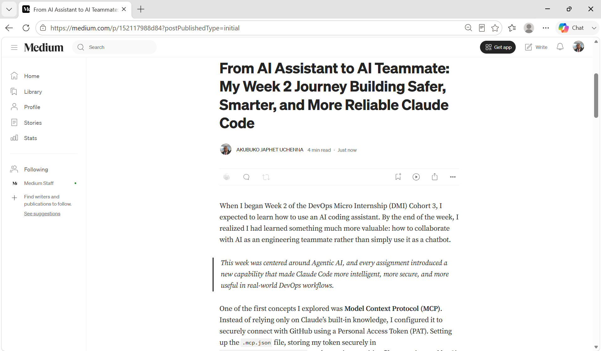
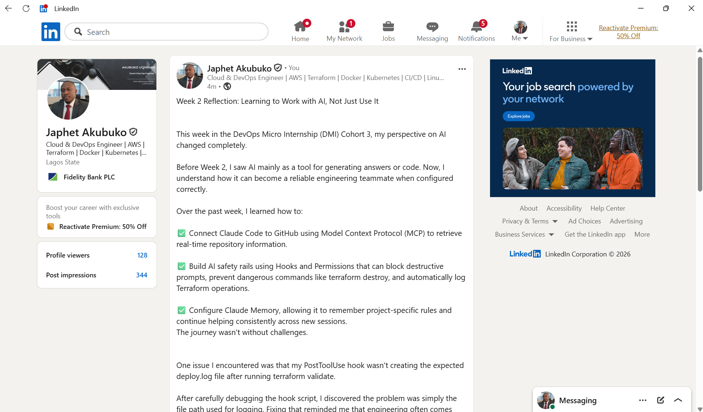

# Assignment 8 — Week 2 Reflection Blog

Part of the DevOps Micro Internship (DMI) Cohort 3 with Agentic AI

---

# Purpose

In this assignment, you will reflect on your Week 2 learning journey and write a short blog capturing your experience working with Agentic AI tools such as Claude Code, Skills, Subagents, MCP, Hooks, Permissions, and Memory.

You will also publish a LinkedIn post summarizing your learning and share both links for evaluation.

---

# Task 1 — Write Your Reflection Blog

## Goal

Write a reflection blog covering your Week 2 learning experience.

### Blog Requirements

Your blog must include:

* Title: **Reflection – Week 2**
* Minimum 300 words
* At least 2–3 topics from Week 2 (Claude Code, Skills, Subagents, MCP, Hooks, Permissions, Memory)
* Honest personal reflection (learning, challenges, mindset)
* One habit/system you plan to implement
* Your full name clearly visible

### Allowed Platforms

You can publish your blog on:

* Hashnode
* Medium
* Dev.to
* LinkedIn Article
* GitHub Markdown file
* Substack

---

### Evidence

#### Screenshot 1 — Blog published and visible



---

### Submission Field

Blog Link:

https://medium.com/@akubukoJaphet/how-week-2-changed-the-way-i-think-about-ai-in-devops-152117988d84

---

# Task 2 — Create LinkedIn Post

## Goal

Share your Week 2 learning publicly on LinkedIn.

---

### LinkedIn Post Requirements

Your post must include:

* One screenshot from any Week 2 assignment
* Short reflection (what you learned or built)
* Required P.S. line exactly as given below

---

### Required P.S. Line (Must Include Exactly)

P.S. This post is a part of DevOps Micro Internship with Agentic AI Cohort-3 by Pravin Mishra. You can start your DevOps journey by joining this Discord community ( [https://discord.pravinmishra.com/](https://discord.pravinmishra.com/) ).

---

### Suggested Hashtags

#DMIByPravinMishra #AgenticAI #ClaudeCode #DevOps #LearningInPublic

---

### Evidence

#### Screenshot 2 — LinkedIn post published




---

### Submission Field

LinkedIn Post Content (copy-paste here):

```
Week 2 Reflection: Learning to Work with AI, Not Just Use It


This week in the DevOps Micro Internship (DMI) Cohort 3, my perspective on AI changed completely.

Before Week 2, I saw AI mainly as a tool for generating answers or code. Now, I understand how it can become a reliable engineering teammate when configured correctly.

Over the past week, I learned how to:

✅ Connect Claude Code to GitHub using Model Context Protocol (MCP) to retrieve real-time repository information.

✅ Build AI safety rails using Hooks and Permissions that can block destructive prompts, prevent dangerous commands like terraform destroy, and automatically log Terraform operations.

✅ Configure Claude Memory, allowing it to remember project-specific rules and continue helping consistently across new sessions.
The journey wasn't without challenges.


One issue I encountered was that my PostToolUse hook wasn't creating the expected deploy.log file after running terraform validate. 

After carefully debugging the hook script, I discovered the problem was simply the file path used for logging. Fixing that reminded me that engineering often comes down to understanding the small details.

I also accidentally merged updated assignment templates into my completed work. Instead of starting over, I reviewed my Git history, identified the correct commit, and safely restored my repository. It was a great lesson in using Git confidently rather than relying on trial and error.

My biggest takeaway from Week 2 is that AI becomes significantly more valuable when it's connected to real tools, guided by safety rules, and able to remember project context. 

That's the kind of workflow I want to continue building as I grow in DevOps.


A big thank you to Pravin Mishra, the co-mentors, and the entire DMI community for the practical guidance throughout this learning journey. Every assignment pushed me to think beyond completing tasks and focus on understanding how these technologies work in real-world engineering.


P.S. This post is a part of DevOps Micro Internship with Agentic AI Cohort-3 by Pravin Mishra. You can start your DevOps journey by joining this Discord community ( https://lnkd.in/eC_gj7_6 ).


#DMIByPravinMishra #AgenticAI #ClaudeCode #DevOps #LearningInPublic #Git #GitHub #Terraform #MCP #CloudComputing
```

---

### LinkedIn Post Link:

https://www.linkedin.com/posts/akubuko-japhet_dmibypravinmishra-agenticai-claudecode-share-7481472149384400896-pATu/?utm_source=share&utm_medium=member_desktop&rcm=ACoAACzB5WwBxyd6sYpN54WYePBkigtWt6eWj8A

---

# Submission Instructions

* Blog must be publicly accessible
* LinkedIn post must be visible (public or unlisted where applicable)
* All required fields must be filled
* Screenshot proofs must be added to GitHub repository
* Do not include sensitive information in blog or post

---

# Completion Checklist

* [ ] Blog written with required structure
* [ ] Blog includes at least 2–3 Week 2 topics
* [ ] Blog is publicly accessible
* [ ] LinkedIn post created
* [ ] Required P.S. line included
* [ ] LinkedIn post content copied in submission field
* [ ] Blog link added
* [ ] LinkedIn post link added
* [ ] Screenshots added to GitHub repo

---

# About DMI & CloudAdvisory

DevOps Micro Internship (DMI) is a project-based DevOps program run by Pravin Mishra (The CloudAdvisory), focused on real-world execution, systems thinking, and agentic AI workflows.

It helps learners build strong DevOps foundations through hands-on experience.

---

# Resources

* 🌐 DMI Official Website: [https://pravinmishra.com/dmi](https://pravinmishra.com/dmi)
* 🎓 DevOps for Beginners (Udemy): [https://www.udemy.com/course/devops-for-beginners-docker-k8s-cloud-cicd-4-projects/](https://www.udemy.com/course/devops-for-beginners-docker-k8s-cloud-cicd-4-projects/)
* 🎓 Agentic AI DevOps with Claude Code: [https://www.udemy.com/course/ultimate-agentic-ai-devops-with-claude-code/](https://www.udemy.com/course/ultimate-agentic-ai-devops-with-claude-code/)
* 🎓 DevOps with Claude Code: Terraform, EKS, ArgoCD & Helm: [https://www.udemy.com/course/devops-with-claude-code-terraform-eks-argocd-helm/](https://www.udemy.com/course/devops-with-claude-code-terraform-eks-argocd-helm/)
* ▶️ YouTube Playlist: [https://www.youtube.com/playlist?list=PLFeSNDtI4Cho](https://www.youtube.com/playlist?list=PLFeSNDtI4Cho)
* 🔗 Pravin Mishra (LinkedIn): [https://www.linkedin.com/in/pravin-mishra-aws-trainer/](https://www.linkedin.com/in/pravin-mishra-aws-trainer/)
* 🏢 CloudAdvisory (LinkedIn): [https://www.linkedin.com/company/thecloudadvisory/](https://www.linkedin.com/company/thecloudadvisory/)

