# Assignment 5 — Bash Script Automation Drill (OPS Checklist)

Part of the DevOps Micro Internship (DMI) Cohort 3 with Agentic AI

---

## Purpose

In this assignment, you will practice Bash scripting by building a series of small automation scripts covering environment setup, variables, arrays, loops, file conditionals, if-else logic, and functions. These scripts form the foundation of real-world Linux automation used in DevOps, cloud, and production support environments.

---

# Task 1 — Bash Environment & Workspace Setup

## Goal

Verify that Bash is available on your system and create a clean workspace for this assignment.

### Evidence

#### Screenshot 1 — Output of `echo $SHELL` and `bash --version`

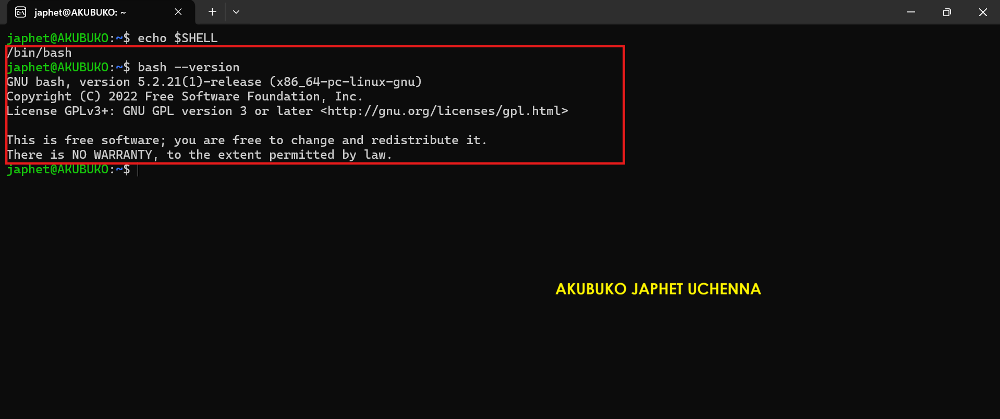

---

#### Screenshot 2 — Output of `pwd` and `ls -lah` showing the scripts directory

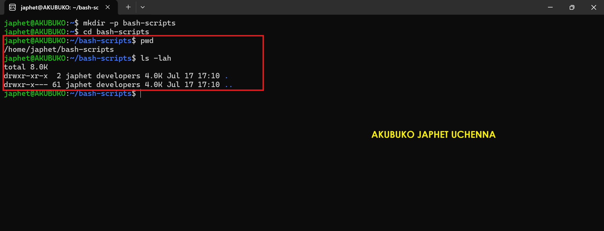

---

### Notes

Answer the following in your own words:

**1. What is Bash?**

Bash (Bourne Again Shell) is a command-line interpreter used to communicate with the Linux operating system. It allows users to execute commands, automate repetitive tasks through scripts, and manage files, processes, and system operations efficiently.

---

**2. What is the difference between shell and Bash?**

A shell is a general program that provides an interface between the user and the operating system. Bash is a specific type of shell that extends the original Bourne Shell with additional features such as command history, tab completion, scripting improvements, arrays, and enhanced programming capabilities. In simple terms, every Bash is a shell, but not every shell is Bash.

---

**3. Why is it important to confirm the Bash version before writing scripts?**

Checking the Bash version helps ensure that the features used in a script are supported by the installed Bash interpreter. Some scripting features are only available in newer versions, so confirming the version reduces compatibility issues and helps scripts run reliably across different Linux environments.

---

# Task 2 — Your First Bash Script

## Goal

Create your first Bash script, make it executable, and run it from the terminal.

### Evidence

#### Screenshot 1 — Content of `first-script.sh`

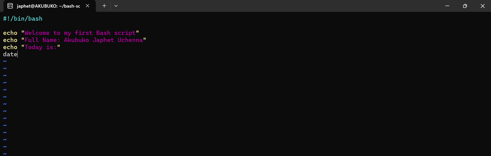

---

#### Screenshot 2 — Output of `./first-script.sh`

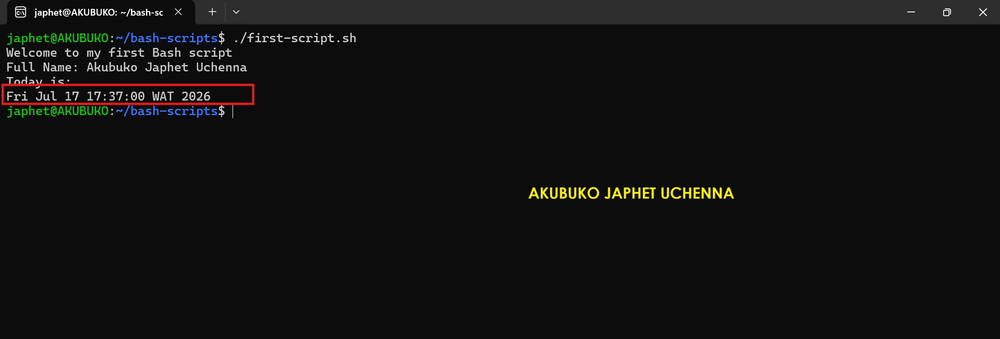

---

#### Screenshot 3 — Output of `ls -l first-script.sh` showing executable permission

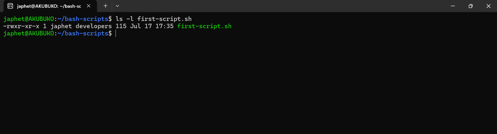

---

### Notes

Answer the following in your own words:

**1. What is the purpose of `#!/bin/bash`?**

The line #!/bin/bash, often called the shebang, tells the operating system to use the Bash interpreter to execute the script. This ensures the script runs with the correct shell regardless of the user's default shell, making its behavior more predictable across Linux systems.

---

**2. Why do we use `chmod +x` before running a script?**

The chmod +x command gives a script execute permission, allowing it to be run directly as a program. Without this permission, the operating system treats the file as a regular text file and prevents it from being executed.

---

**3. What is the difference between running a script using `./script.sh` and `bash script.sh`?**

Running a script with "./script.sh" executes the file directly and requires it to have execute permission. Running it with bash "script.sh" explicitly starts the Bash interpreter and passes the script to it, so execute permission on the script itself is not required.

---

# Task 3 — Variables: User Information Script

## Goal

Use variables to store and display user-related information.

### Evidence

#### Screenshot 1 — Content of `user-info.sh`

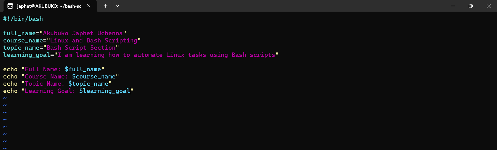

---

#### Screenshot 2 — Output of `./user-info.sh`

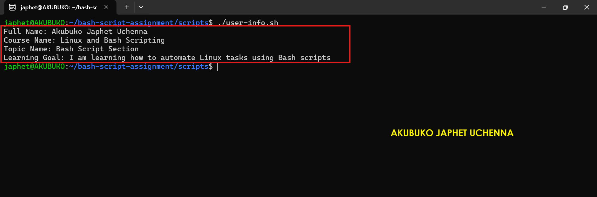

---

### Notes

Answer the following in your own words:

**1. What is a variable in Bash?**

A variable in Bash is a named container used to store data that can be reused throughout a script. Instead of repeating the same value multiple times, the information is stored once and referenced whenever needed. This makes scripts easier to read, update, and maintain.

---

**2. Why should we avoid spaces around the `=` sign when creating variables?**

Bash requires variable assignments to be written without spaces around the = sign. Adding spaces causes Bash to interpret the statement incorrectly, often treating the variable name and value as separate commands, which results in an error.

---

**3. How do you access the value stored inside a Bash variable?**

A variable's value is accessed by placing a dollar sign ($) before its name. For example, if a variable is defined as name="Japhet", its value can be displayed using $name or echo $name.

---

# Task 4 — Arrays & Loops: Tools Checklist Script

## Goal

Use arrays and loops to print a checklist of tools used in Bash scripting.

### Evidence

#### Screenshot 1 — Content of `tools-checklist.sh`

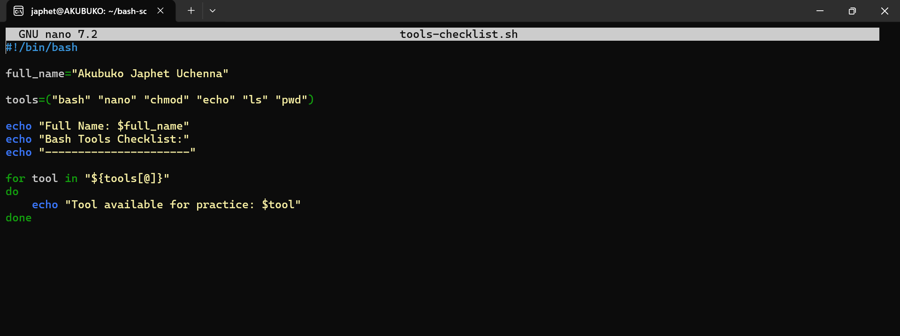

---

#### Screenshot 2 — Output of `./tools-checklist.sh`

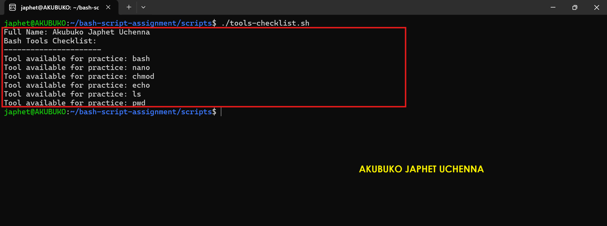

---

### Notes

Answer the following in your own words:

**1. What is an array in Bash?**

An array in Bash is a collection of related values stored under a single variable name. Each item is assigned an index, allowing multiple pieces of information to be grouped together and accessed individually or processed as a collection.

---

**2. Why are arrays useful in scripts?**

Arrays make scripts more organized by allowing multiple related values to be stored in one variable. They simplify repetitive tasks, reduce duplicate code, and make it easier to loop through lists such as files, servers, users, or software packages.

---

**3. What does `"${tools[@]}"` mean?**

"${tools[@]}" represents all the elements stored in the tools array. When used in a loop, it allows Bash to process each array element one at a time while preserving spaces within individual items.

---

**4. What is the purpose of the `for` loop in this script?**

The for loop automatically processes every item in the array without requiring separate commands for each one. This makes the script shorter, easier to maintain, and more efficient when working with multiple values.

---

# Task 5 — Loops: Number Counter Script

## Goal

Use loops to repeat a task multiple times.

### Evidence

#### Screenshot 1 — Content of `counter.sh`

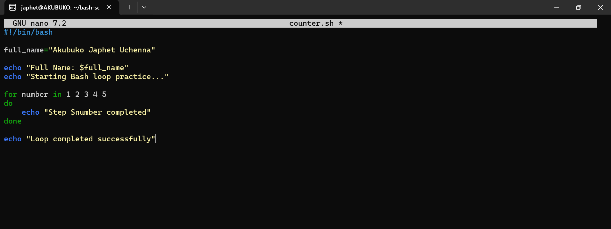

---

#### Screenshot 2 — Output of `./counter.sh`

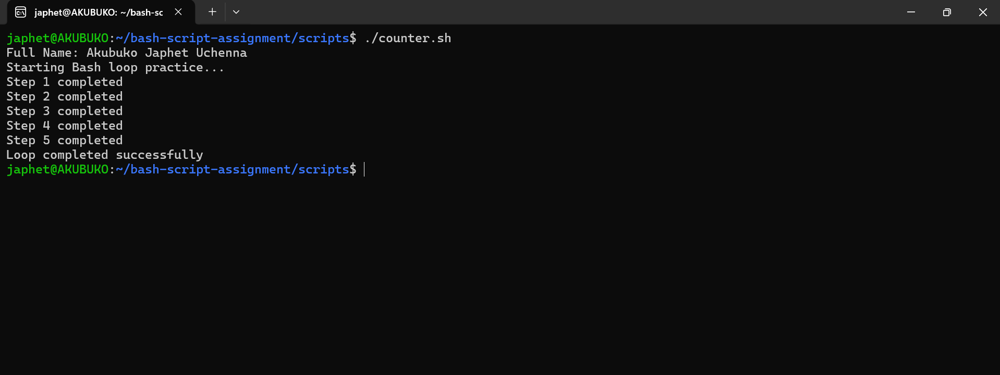

---

### Notes

Answer the following in your own words:

**1. What is a loop?**

A loop is a programming structure that repeatedly executes a block of code until a specified condition is met or all items in a sequence have been processed. It helps automate repetitive tasks without writing the same commands multiple times.

---

**2. Why do we use loops in Bash scripting?**

Loops are used to automate repetitive operations efficiently. Instead of repeating commands manually, a loop can process multiple files, users, directories, or numbers with a single block of code, making scripts shorter, more reliable, and easier to maintain.

---

**3. How many times did the loop run in your script?**

The loop ran five times, displaying the numbers from 1 through 5 before completing the script.

---

**4. What would you change if you wanted the loop to run 10 times?**

I would modify the loop range from {1..5} to {1..10} so that Bash iterates through ten numbers instead of five.

---

# Task 6 — Files & Conditionals: File Validation Script

## Goal

Use file checks and conditionals to verify whether files and directories exist.

### Evidence

#### Screenshot 1 — Output of `ls -lah ../test-folder`

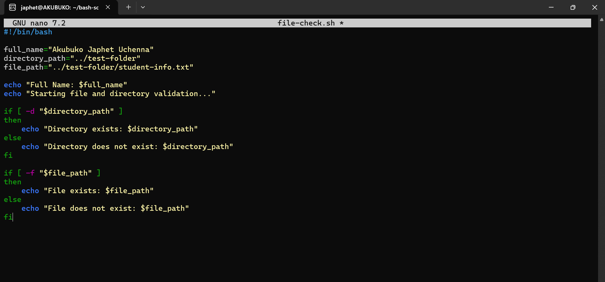

---

#### Screenshot 2 — Content of `file-check.sh`

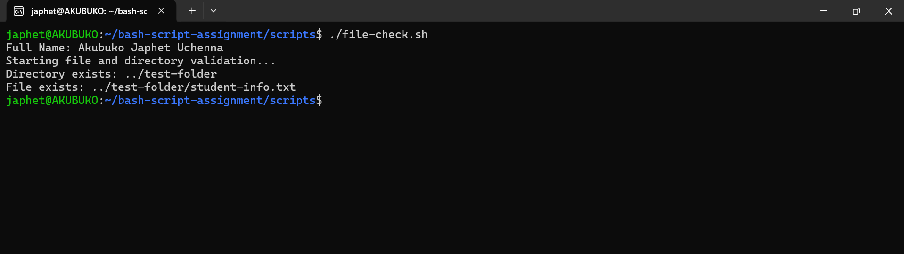

---

#### Screenshot 3 — Output of `./file-check.sh`

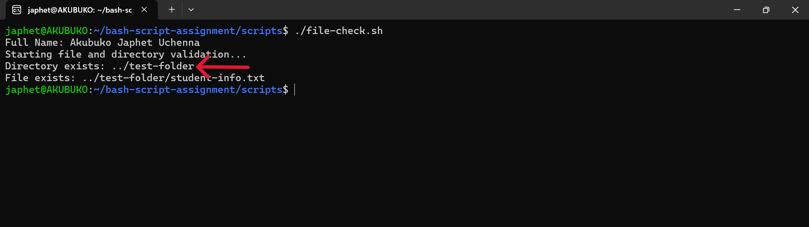

---

### Notes

Answer the following in your own words:

**1. What does `-d` check in Bash?**

The -d test checks whether a specified path exists and is a directory. It returns true only if the directory is present, allowing scripts to safely work with folders without causing errors.

---

**2. What does `-f` check in Bash?**

The -f test checks whether a specified path exists and is a regular file. It is commonly used before reading from or modifying a file to ensure the file is available.

---

**3. Why should file and directory paths be stored in variables?**

Storing paths in variables makes scripts easier to maintain and update. If a path changes, it only needs to be modified in one place instead of throughout the entire script. This improves readability, reduces duplication, and minimizes errors.

---

**4. What happens if the file does not exist?**

If the file does not exist, the -f condition evaluates to false, and the script executes the else block. This allows the script to notify the user or take an alternative action instead of failing unexpectedly.

---

# Task 7 — Conditionals: Pass or Retry Script

## Goal

Use if-else conditionals to make decisions based on a variable value.

### Evidence

#### Screenshot 1 — Content of `score-check.sh` with `score=85`

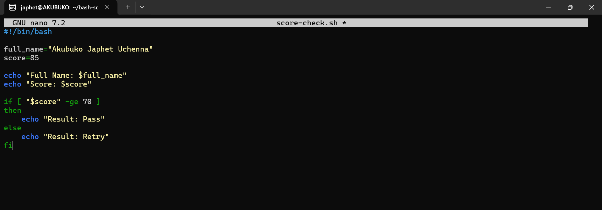

---

#### Screenshot 2 — Output showing `Result: Pass`

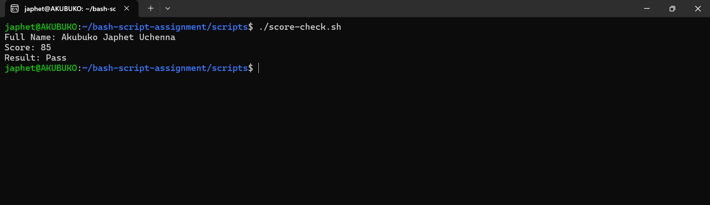

---

#### Screenshot 3 — Content of `score-check.sh` with `score=55`

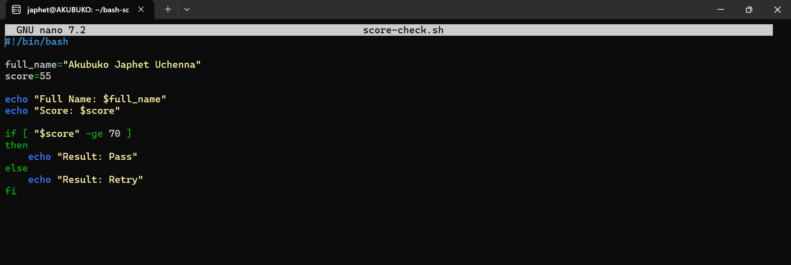

---

#### Screenshot 4 — Output showing `Result: Retry`

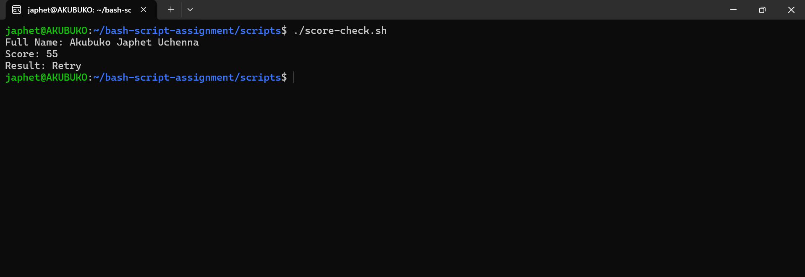

---

### Notes

Answer the following in your own words:

**1. What is the purpose of if-else in Bash?**

The if-else statement allows a Bash script to make decisions based on whether a condition is true or false. It enables scripts to perform different actions depending on the result of a comparison, making automation more flexible and intelligent.

---

**2. What does `-ge` mean?**

The -ge operator means greater than or equal to. It is used to compare two integer values and returns true when the value on the left is greater than or equal to the value on the right.

---

**3. Why should conditions be tested with different values?**

Testing different values helps verify that every branch of the conditional logic works correctly. It ensures the script behaves as expected for both successful and unsuccessful scenarios, reducing the risk of unexpected behavior in real-world use.

---

**4. How can conditionals help in automation scripts?**

Conditionals allow automation scripts to respond dynamically to different situations. For example, they can check whether a service is running, verify if a file exists, or determine whether a deployment succeeded before deciding what action to take next.

---

# Task 8 — Functions: Final Bash Automation Script

## Goal

Create a final Bash script using functions to organize reusable code.

### Evidence

#### Screenshot 1 — Content of `final-automation.sh`

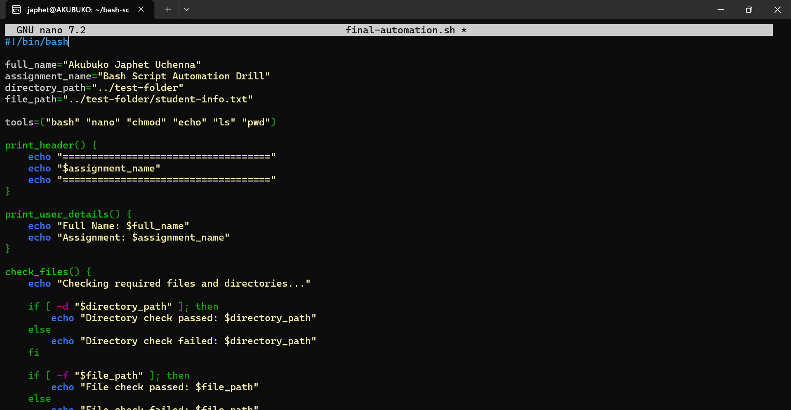

---

#### Screenshot 2 — Output of `./final-automation.sh`

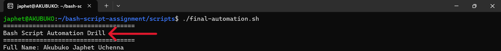

---

#### Screenshot 3 — Output of `ls -lah` showing all created scripts

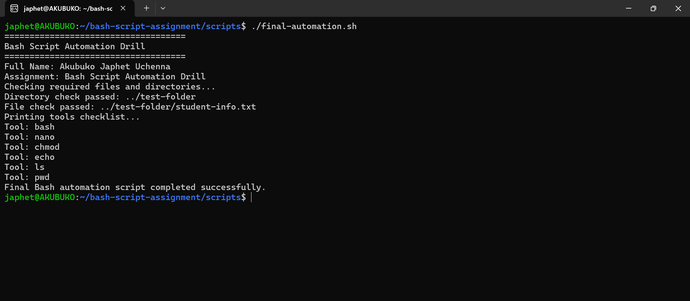

---

### Notes

Answer the following in your own words:

**1. What is a function in Bash?**

A function in Bash is a named block of reusable commands that performs a specific task. Instead of repeating the same code in different parts of a script, a function allows the logic to be written once and called whenever it is needed. This makes scripts more organized, readable, and easier to maintain.

---

**2. Why are functions useful in scripts?**

Functions improve script organization by separating tasks into logical sections. They reduce code duplication, simplify maintenance, and make scripts easier to test, update, and reuse in larger automation projects.

---

**3. Which functions did you create in this script?**

I created four functions:

show_header() to display the script title.
show_user() to display user and assignment information.
show_tools() to loop through and display the DevOps tools stored in an array.
check_workspace() to verify that the Bash workspace directory exists before completing the script.

---

**4. How does this final script combine variables, arrays, loops, conditionals, files, and functions?**

This script combines several Bash concepts into one automation workflow. Variables store personal and assignment information, an array holds the list of DevOps tools, a for loop displays each tool, a conditional checks whether the workspace directory exists, and functions organize each task into reusable sections. Together, these features demonstrate how Bash can be used to build structured, maintainable, and practical automation scripts.

---

# LinkedIn Post (Required)

## Evidence

#### LinkedIn Post URL

https://www.linkedin.com/posts/akubuko-japhet_devops-linux-bash-ugcPost-7484390293040103424-8myE/?utm_source=share&utm_medium=member_desktop&rcm=ACoAACzB5WwBxyd6sYpN54WYePBkigtWt6eWj8A

`__________________________`

---

#### Screenshot — Published LinkedIn post

---

# Submission Instructions

- Add all required screenshots in your submission
- Full name must be visible in required screenshots
- All script files must be created and run successfully
- Required notes must be answered clearly for every task
- Do not expose sensitive information (keys, passwords, credentials)

---

# Completion Checklist

- [ ] Task 1: Environment setup verified, workspace created (Screenshots 1–2, Notes answered)
- [ ] Task 2: First script created, executed, permissions verified (Screenshots 1–3, Notes answered)
- [ ] Task 3: Variables script created and run (Screenshots 1–2, Notes answered)
- [ ] Task 4: Arrays and loops script created and run (Screenshots 1–2, Notes answered)
- [ ] Task 5: Counter loop script created and run (Screenshots 1–2, Notes answered)
- [ ] Task 6: File validation script created and run (Screenshots 1–3, Notes answered)
- [ ] Task 7: Pass/Retry conditional script tested with both values (Screenshots 1–4, Notes answered)
- [ ] Task 8: Final automation script created and run (Screenshots 1–3, Notes answered)
- [ ] All scripts run without errors
- [ ] Full Name visible in all required screenshots
- [ ] LinkedIn post published and URL submitted
- [ ] No sensitive data exposed

---

## 📌 About DMI & CloudAdvisory

DevOps Micro Internship (DMI) is a project-based DevOps program run by Pravin Mishra (The CloudAdvisory) focused on real-world execution, systems thinking, and career readiness.

It helps learners build strong DevOps foundations with hands-on experience.

---

## 📌 Resources

- 🌐 DMI Official Website: https://pravinmishra.com/dmi  
- 🎓 DevOps for Beginners (Udemy): https://www.udemy.com/course/devops-for-beginners-docker-k8s-cloud-cicd-4-projects/  
- 🎓 Agentic AI DevOps with Claude Code: https://www.udemy.com/course/ultimate-agentic-ai-devops-with-claude-code/  
- 🎓 DevOps with Claude Code: Terraform, EKS, ArgoCD & Helm: https://www.udemy.com/course/devops-with-claude-code-terraform-eks-argocd-helm/  
- ▶️ YouTube Playlist: https://www.youtube.com/playlist?list=PLFeSNDtI4Cho  
- 🔗 Pravin Mishra (LinkedIn): https://www.linkedin.com/in/pravin-mishra-aws-trainer/  
- 🏢 CloudAdvisory (LinkedIn): https://www.linkedin.com/company/thecloudadvisory/

---

*This submission is part of DevOps Micro Internship (DMI) Cohort 3 — Agentic AI Track.*
