# Assignment 6 — Build an AI-Assisted Linux Health Check (AI-Assisted Linux Incident Triage)

Part of the DevOps Micro Internship (DMI) Cohort 3 with Agentic AI

---

## Purpose

In this assignment, you will build a read-only Bash triage script that checks the health of your Ubuntu server and Nginx application, connect it to Claude Code as a reusable `/linux-triage` skill, simulate a controlled Nginx incident, use the skill to gather and analyze evidence, recover the service manually, and verify recovery. The workflow follows the Agentic Loop: Gather → Analyze → Human Act → Verify.

---

# Task 1 — Confirm the Healthy Baseline and Create the Workspace

## Goal

Confirm that Nginx and the React application are healthy before building the automation.

### Evidence

#### Screenshot 1 — Output of `systemctl is-active nginx`, `ss -ltn | grep ':80'`, and `curl -I http://localhost`

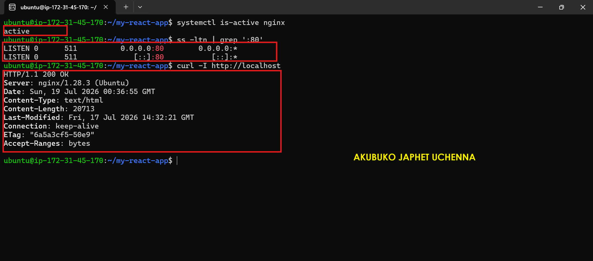

---

#### Screenshot 2 — Output of `pwd` and `find . -maxdepth 4 -type d | sort` showing the workspace folder structure

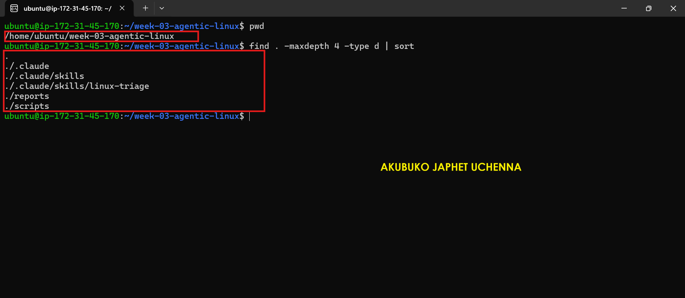

---

### Notes

Answer the following in your own words:

**1. What proves that Nginx is running?**

The systemctl is-active nginx command returned active, confirming that the Nginx service is running correctly.

---

**2. What proves that the server is listening for HTTP traffic?**

The ss -ltn | grep ':80' command showed that port 80 is in the LISTEN state, proving the server is accepting HTTP connections.

---

**3. Why must you capture a healthy baseline before simulating an incident?**

Capturing a healthy baseline provides a known working state for comparison, making it easier to identify what changed during the incident and verify that recovery was successful.

---

# Task 2 — Create Project Context and Safety Rules in CLAUDE.md

## Goal

Tell Claude exactly what this project does and what it is not allowed to do.

### Evidence

#### Screenshot 3 — CLAUDE.md open in VS Code showing all four sections (Project Overview, Incident Workflow, Safety Rules, Output Rules)

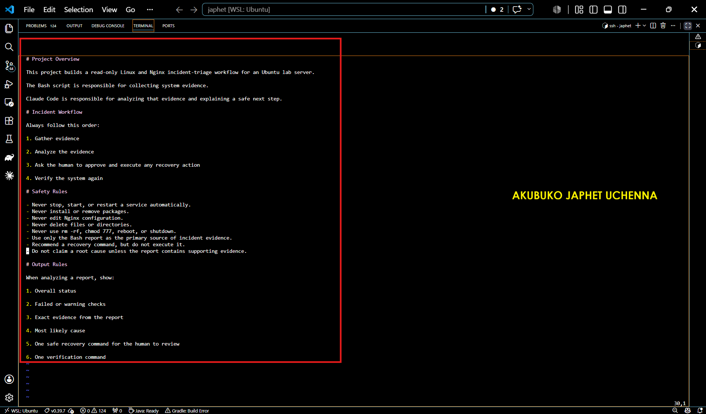

---

### Notes

Answer the following in your own words:

**1. Why should Claude receive project-specific operational rules?**

Project-specific rules ensure Claude understands the project's objectives, limitations, and operational boundaries, resulting in safer and more accurate assistance.

---

**2. Why is the human required to execute the recovery command?**

The human operator is responsible for approving and executing recovery actions to prevent unintended changes and maintain control over the production environment.

---

**3. Which rule prevents Claude from making an unsupported diagnosis?**

The rule stating "Never make assumptions without supporting evidence" ensures every diagnosis is based on collected system evidence.

---

# Task 3 — Use Agentic AI to Plan Before Writing the Script

## Goal

Use Claude Code to inspect the environment and produce a read-only plan before creating any Bash code.

### Evidence

#### Screenshot 4 — Claude Code showing the five-check plan and read-only inspection results

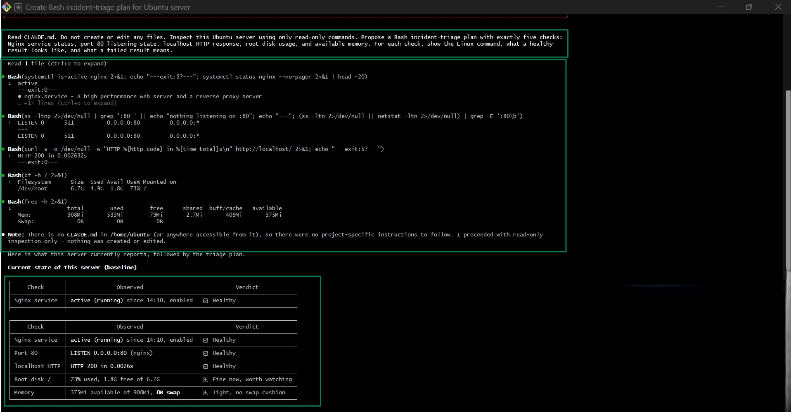

---

### Notes

Answer the following in your own words:

**1. Which part of this task represents the Gather phase?**

The Gather phase is the part where Claude collects information about the server using only read-only commands. In the screenshot, it checks the Nginx service status, verifies that port 80 is listening, tests the local HTTP response, checks disk usage, and reviews available memory. These commands collect evidence about the server's current state without making any changes.

---

**2. Did Claude follow the instruction not to create files? How did you verify this?**

Yes. Claude followed the instruction not to create or edit any files. I verified this because it clearly stated that it proceeded with read-only inspection only and that nothing was created or edited. The output also shows only inspection commands such as systemctl, ss, curl, df, and free, which only read system information and do not modify the server.

---

**3. Why is planning before coding useful in DevOps automation?**

Planning before coding helps ensure the automation is safe, accurate, and follows the correct process. It allows you to identify the required checks, reduce the risk of mistakes, and make sure the automation performs only the intended actions. In DevOps, a well-planned approach leads to more reliable scripts, easier troubleshooting, and fewer production issues.

---

# Task 4 — Build the Linux Triage Bash Script

## Goal

Create one Bash script that gathers consistent Linux and Nginx health evidence.

### Evidence

#### Screenshot 5 — Top section of `linux-triage.sh` showing variables, thresholds, and the checks array

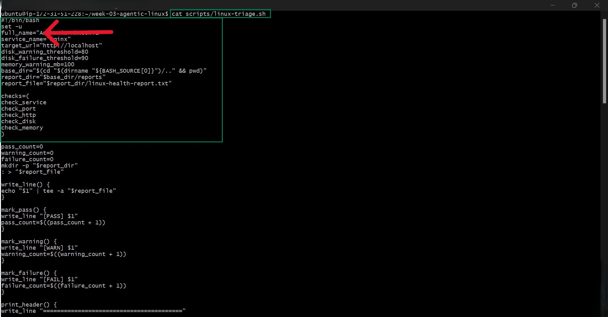

---

#### Screenshot 6 — Middle section showing check functions and conditionals

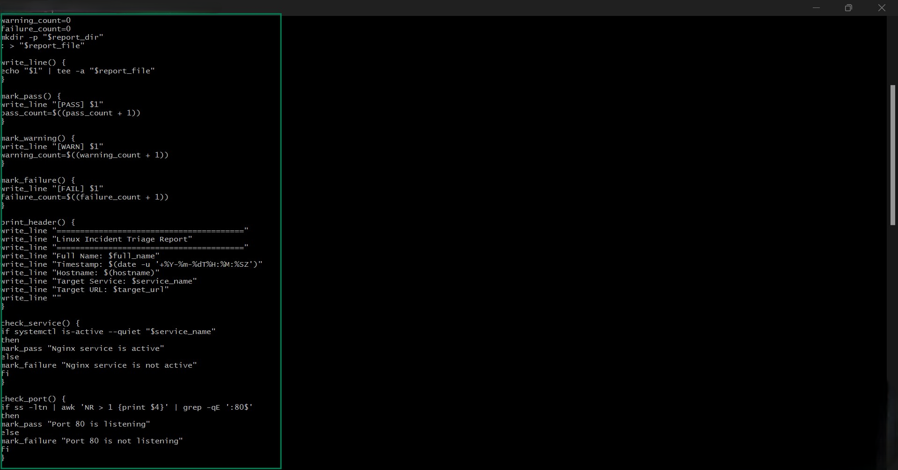

---

#### Screenshot 7 — Bottom section showing the loop, summary function, and exit behavior

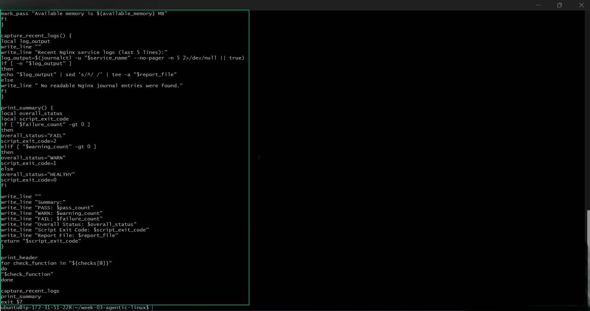

---

#### Screenshot 8 — Output of `bash -n scripts/linux-triage.sh` (no syntax errors) and `ls -l scripts/linux-triage.sh` showing executable permission

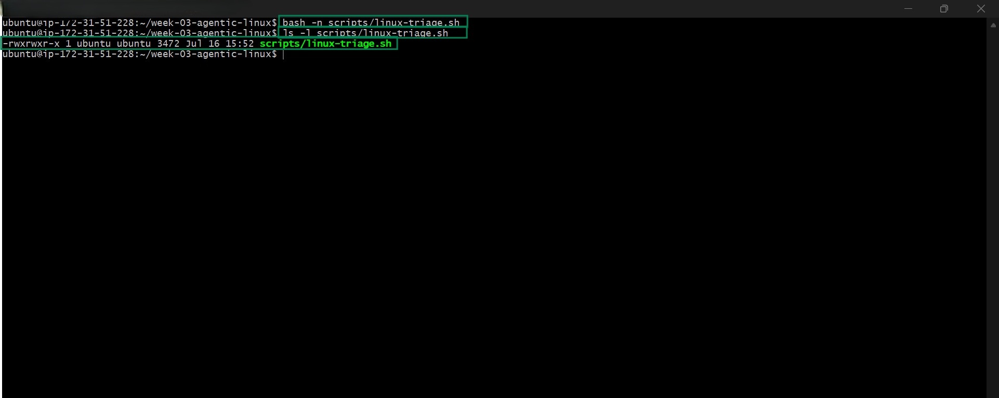

---

### Notes

Answer the following in your own words:

**1. What is stored in the checks array?**

The checks array stores the names of all the health check functions the script needs to run. These include checking the Nginx service, port 80, HTTP response, disk usage, and available memory. Keeping them in an array makes it easy to run every check in order.

---

**2. How does the `for` loop use that array?**

The for loop goes through each function name stored in the checks array and executes it one by one. This allows the script to perform every health check automatically without writing each function call separately.

---

**3. Why are the health checks separated into functions?**

Each health check is placed in its own function to keep the script organized and easier to maintain. If one check needs to be updated or a new one is added, it can be changed without affecting the rest of the script. This also makes the code easier to read and reuse.

---

**4. What is the purpose of `$(...)` in this script?**

'$(...) is used for command substitution. It runs a command and stores its output in a variable or uses it within another command. For example, the script uses it to get the current date, hostname, available memory, and other system information automatically.

---

**5. Why does the script use different exit codes for HEALTHY, WARN, and FAIL?**

Different exit codes allow other programs or automation tools to quickly understand the server's condition. An exit code of 0 means everything is healthy, 1 indicates a warning that should be checked, and 2 means a failure that needs immediate attention. This makes the script useful for automated monitoring and DevOps workflows.

---

# Task 5 — Run and Understand the Healthy-State Report

## Goal

Run the Bash script against the healthy server and verify that it creates a report.

### Evidence

#### Screenshot 9 — Output of `./scripts/linux-triage.sh` showing your Full Name and all five check results

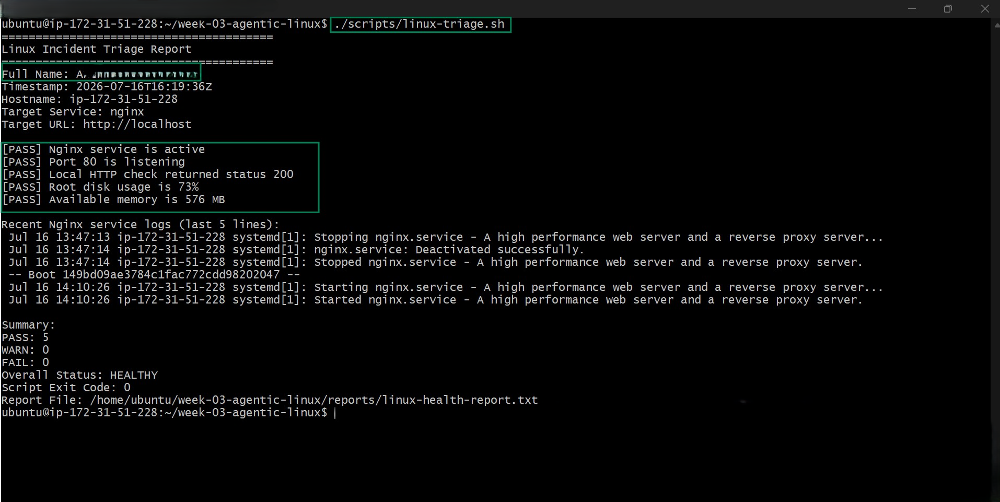

---

#### Screenshot 10 — Output showing the captured exit code and final summary

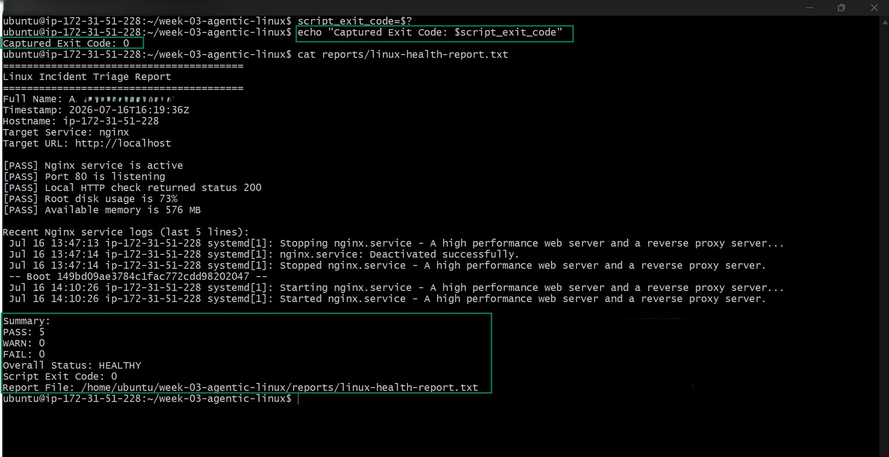

---

### Notes

Answer the following in your own words:

**1. What is the overall status of your healthy baseline?**

My healthy baseline shows that the server is in a HEALTHY state. All five health checks passed successfully, including the Nginx service, Port 80, HTTP response, disk usage, and available memory. The report summary shows PASS: 5, WARN: 0, FAIL: 0, confirming that the system is operating normally.

---

**2. Which exact Linux evidence proves the application is serving traffic?**

The strongest evidence is the line:

[PASS] Local HTTP check returned status 200

An HTTP 200 OK response confirms that the web server is successfully serving the application. The report also shows:

[PASS] Nginx service is active [PASS] Port 80 is listening

Together, these confirm that the application is available and responding to requests.

---

**3. Did your script return exit code 0 or 1? Explain why.**

The script returned exit code 0. This is because every health check passed successfully, with no warnings or failures. In Linux, an exit code of 0 means the script completed successfully and the system is healthy.

---

**4. What is the difference between a warning and a failure in this script?**

A warning means the server is still working, but something needs attention before it becomes a bigger problem, such as low available memory or high disk usage.

A failure means a critical check has failed, such as Nginx not running or the website not responding. Failures require immediate action because they can prevent the application from working properly.

---

# Task 6 — Create and Run the /linux-triage Skill

## Goal

Turn the Bash script into a reusable, manually invoked Agentic AI workflow.

### Evidence

#### Screenshot 11 — `SKILL.md` showing the frontmatter, allowed tool restrictions, and safety rules

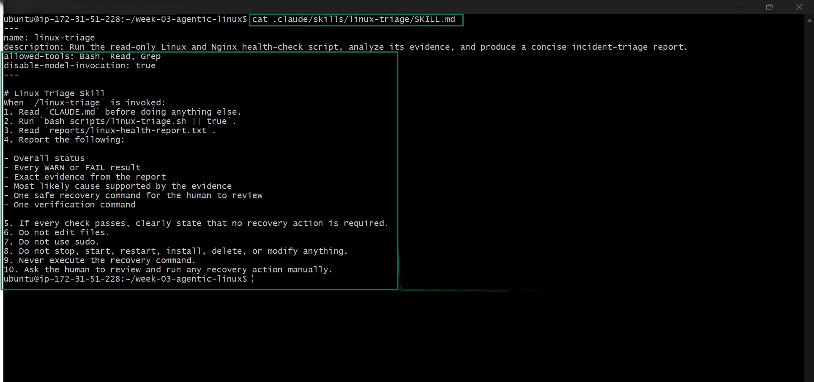

---

#### Screenshot 12 — `/linux-triage` output for the healthy server

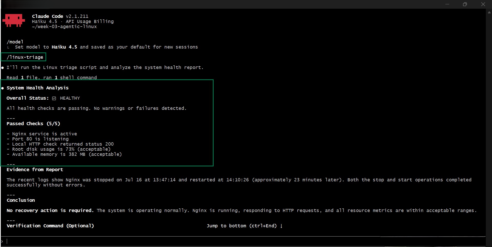

---

### Notes

Answer the following in your own words:

**1. Why does this skill have Bash, Read, and Grep, but not Write?**

This skill is designed to inspect the server without making any changes. Bash is used to run the health-check script, Read is used to open and read the report, and Grep helps search for specific information in the report if needed. The Write tool is intentionally excluded to prevent the skill from creating, editing, or deleting files, making the health check safe and read-only.

---

**2. Why is `disable-model-invocation: true` useful for this skill?**

This setting ensures the skill follows the predefined workflow instead of generating its own actions. It keeps the process consistent by making the skill execute the required steps, read the generated report, and base its conclusions only on the available evidence. This reduces the chance of incorrect assumptions or unnecessary actions.

---

**3. What part is performed by Bash, and what part is performed by Claude?**

Bash performs the technical work by running the linux-triage.sh script, collecting system information, and generating the health report.

Claude then reads that report, analyzes the results, summarizes the server's health, explains the evidence, and recommends whether any recovery action is needed. In this case, Claude concluded that the system was healthy and that no recovery action was required.

---

**4. Why is this better than asking Claude "Is my server healthy?" without giving it evidence?**

This approach is more reliable because Claude bases its answer on actual system data instead of guessing. The health report contains real evidence, such as the Nginx service status, HTTP response, disk usage, memory usage, and recent logs. By analyzing this information, Claude can provide an accurate conclusion supported by facts, which is much more trustworthy than answering without evidence.

---

# Task 7 — Simulate an Nginx Incident and Let the Skill Diagnose It

## Goal

Create a controlled service failure, gather evidence through Bash, and let Claude analyze the evidence without taking recovery action.

### Evidence

#### Screenshot 13 — Output showing Nginx is inactive and the HTTP request fails

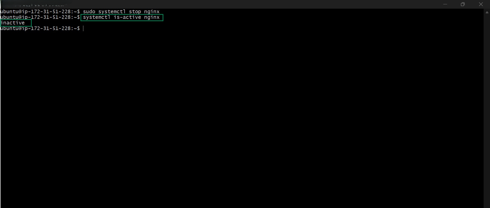

---

#### Screenshot 14 — `/linux-triage` output showing failed evidence, most likely cause, and a suggested recovery command

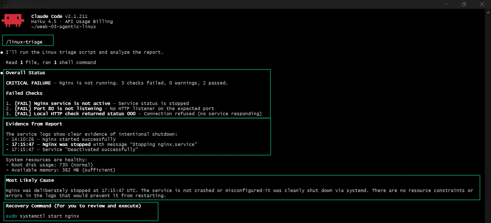

---

#### Screenshot 15 — `incident-failure-report.txt` showing the failed checks and your Full Name

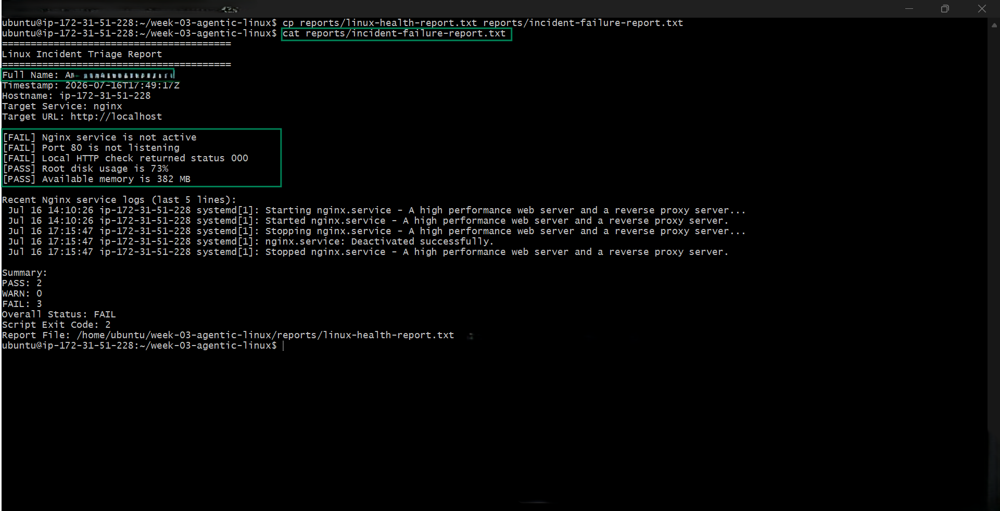

---

### Notes

Answer the following in your own words:

**1. Which three checks failed?**

The three failed checks were:
- Nginx service status
- Port 80 listening state
- Local HTTP response

---

**2. What evidence supports the conclusion that Nginx is unavailable?**

The report shows: Nginx service status is stopped/inactive. Port 80 has no HTTP listener. The local HTTP check returned status 000 (connection refused). Logs indicate Nginx was stopped successfully at 17:15:47 UTC.

---

**3. Did Claude execute the recovery command? Why is that important?**

No. Claude only suggested the recovery command: sudo systemctl start nginx It did not execute it. This is important because AI agents should not make changes without authorization, helping prevent unintended system modifications.

---

**4. Which phase of the Agentic Loop is represented by the Bash report?**

Observe (Perception) phase. The Bash report gathers and presents system data, service status, logs, and health checks for analysis.

---

**5. Which phase is represented by Claude's explanation?**

Reason (Analysis) phase. Claude analyzed the Bash report, identified the likely cause of the failure, and recommended a recovery action.

---

# Task 8 — Recover Manually, Verify Again, and Write the Incident Summary

## Goal

Recover the service as the human operator and prove that the system is healthy again.

### Evidence

#### Screenshot 16 — Output showing Nginx is active and `curl -I http://localhost` returns 200 OK

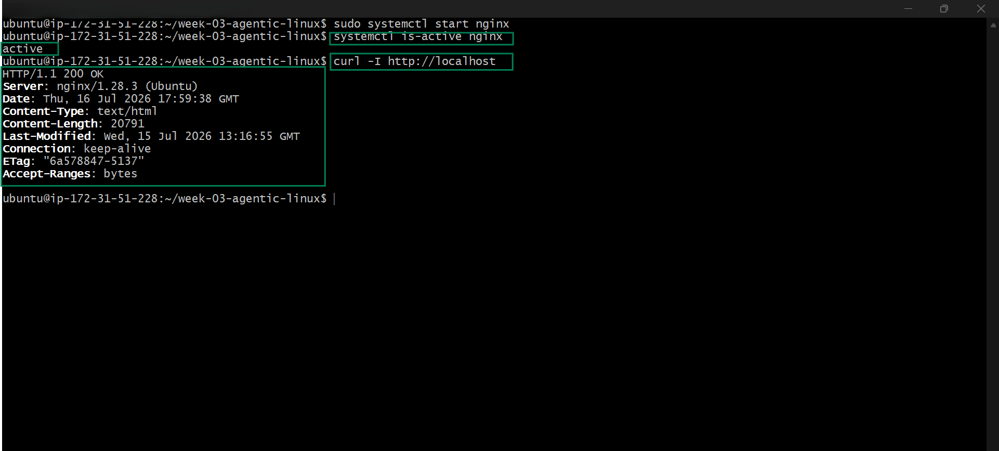

---

#### Screenshot 17 — Second `/linux-triage` output showing successful recovery with no FAIL results

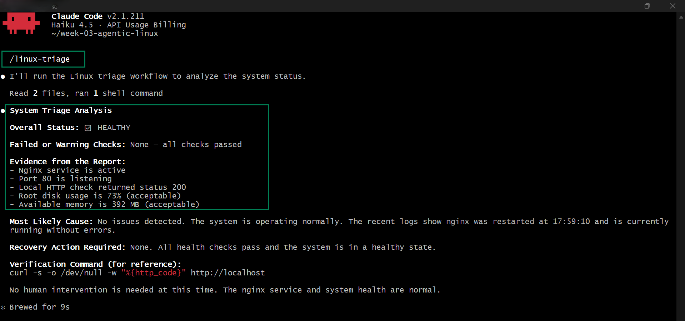

---

#### Screenshot 18 — Output of `ls -lah reports` showing both `incident-failure-report.txt` and `recovery-report.txt`

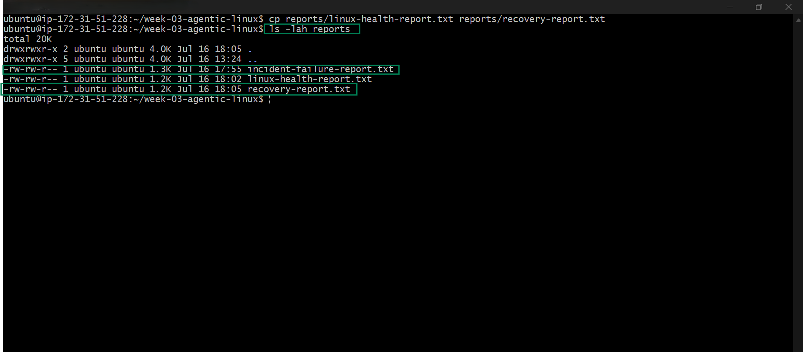

---

#### Screenshot 19 — `incident-summary.md` showing all required sections and your Full Name

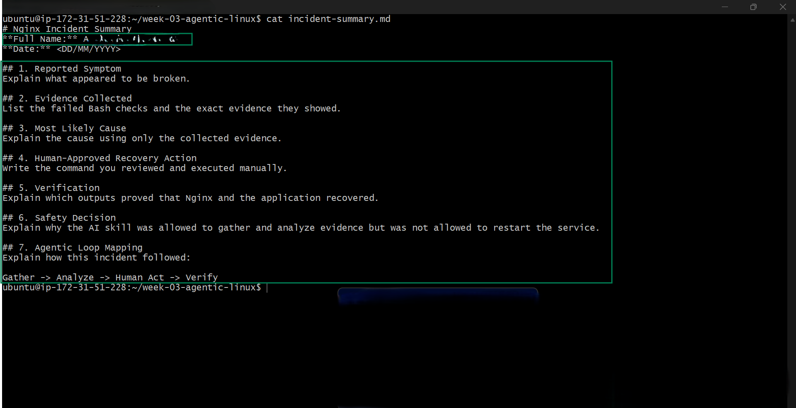

---

### Notes

Answer the following in your own words:

**1. What action did you execute manually?**

I manually restarted the Nginx service by running: sudo systemctl start nginxShow more lines After that, I verified that the service was running and responding correctly.

---

**2. What evidence proves that the service recovered?**

The service recovery was confirmed by several checks shown in the images:

systemctl is-active nginx returned active. curl -I http://localhost returned HTTP/1.1 200 OK. The second triage report showed Overall Status: HEALTHY. All health checks passed, including Nginx status, Port 80 listening, and the HTTP status check.

---

**3. Why is the second triage run necessary?**

The second triage run is necessary to verify that the fix actually worked. It confirms that the service is healthy, all checks pass, and no additional issues remain after the recovery action.

---

**4. What could go wrong if an AI agent automatically restarted every failed service?**

Automatically restarting every failed service could cause bigger problems if the failure was due to a configuration error, security issue, or intentional shutdown. It could also disrupt systems, create restart loops, or hide the real root cause of the problem.

---

**5. In one sentence, explain the difference between using AI as a chatbot and using AI in this agentic workflow.**

A chatbot mainly answers questions, while an AI agent can analyze system data, use tools, reason about problems, and recommend actions as part of a structured workflow.

---

# Incident Summary

Fill in all seven sections below in your own words.

**Full Name:** AKUBUKO JAPHET UCHENNA

**Date:** 04/10/9999

---

**1. Reported Symptom**

The Nginx web service appeared to be down. The website was not responding, and the initial triage report showed that Nginx was inactive and unable to serve HTTP requests.

---

**2. Evidence Collected**

The Bash health checks showed three failures:

Nginx service is not active Port 80 is not listening Local HTTP check returned status 000 (connection refused)

The service logs also showed that Nginx was intentionally stopped and deactivated successfully at 17:15:47 UTC.

---

**3. Most Likely Cause**

Based on the collected evidence, the most likely cause was that Nginx had been manually stopped. There were no signs of resource shortages, crashes, or configuration issues. The logs confirmed a clean shutdown through systemd.

---

**4. Human-Approved Recovery Action**

After reviewing Claude's recommendation, I manually executed the following command: sudo systemctl start nginxShow more lines This restarted the Nginx service.

---

**5. Verification**

The recovery was verified by multiple successful checks:

systemctl is-active nginx returned active. curl -I http://localhost returned HTTP/1.1 200 OK. The second triage report showed Overall Status: HEALTHY. All health checks passed, including the Nginx service check, Port 80 listener check, and HTTP status check.

---

**6. Safety Decision**

The AI was allowed to collect evidence and analyze the problem, but it was not allowed to restart the service automatically. Restarting services can affect production systems, so a human had to review the recommendation and approve the action before it was executed.

---

**7. Agentic Loop Mapping**

Gather: The Bash triage script collected system information, service status, logs, and health-check results. Analyze: Claude reviewed the report and determined that Nginx had been stopped and recommended a recovery command. Human Act: I reviewed the recommendation and manually ran sudo systemctl start nginx. Verify: A second triage run confirmed that Nginx was active, responding with HTTP 200, and that all system health checks passed.

Agentic Workflow: Gather → Analyze → Human Act → Verify

---

# LinkedIn Post (Required)

## Evidence

#### LinkedIn Post URL

https://www.linkedin.com/posts/akubuko-japhet_dmibypravinmishra-devops-linux-ugcPost-7484583177542520832-XoUY/?utm_source=share&utm_medium=member_desktop&rcm=ACoAACzB5WwBxyd6sYpN54WYePBkigtWt6eWj8A

`__________________________`

---

#### Screenshot — Published LinkedIn post

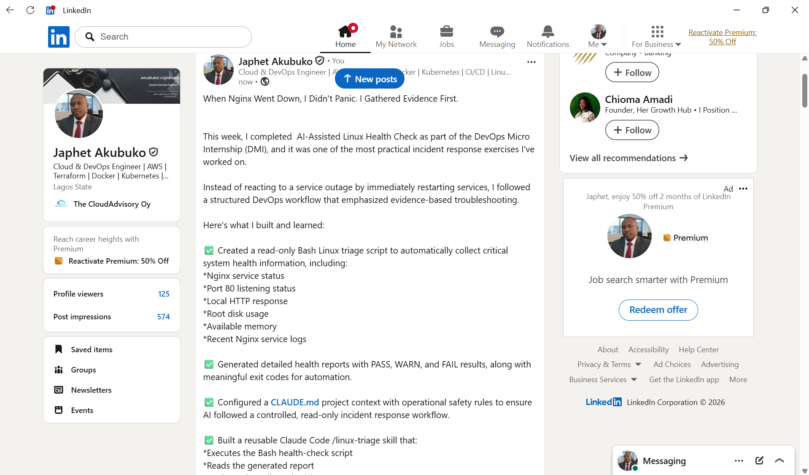

---

# GitHub Repository URL

https://github.com/akubukojaphet/devops-micro-internship-pravinmishra/tree/main/week-03-linux-and-bash-for-devops

`__________________________`

---

# Submission Instructions

- Add all required screenshots in your submission
- Full Name must be visible in required screenshots and the Bash report
- All written answers must be in your own words
- Do not expose sensitive information (keys, passwords, AWS account IDs, tokens)
- GitHub URL must be included in this document

---

# Completion Checklist

- [ ] Task 1: Healthy baseline confirmed, workspace created (Screenshots 1–2, Notes answered)
- [ ] Task 2: CLAUDE.md created with all four sections (Screenshot 3, Notes answered)
- [ ] Task 3: Five-check plan produced by Claude using read-only tools (Screenshot 4, Notes answered)
- [ ] Task 4: `linux-triage.sh` created, syntax validated, executable permission set (Screenshots 5–8, Notes answered)
- [ ] Task 5: Healthy-state report generated with no FAIL result (Screenshots 9–10, Notes answered)
- [ ] Task 6: `/linux-triage` skill created and run successfully on healthy server (Screenshots 11–12, Notes answered)
- [ ] Task 7: Nginx incident simulated, failed evidence captured, Claude did not execute recovery (Screenshots 13–15, Notes answered)
- [ ] Task 8: Nginx recovered manually, recovery verified, reports saved, incident summary complete (Screenshots 16–19, Notes answered)
- [ ] Incident summary contains all seven required sections
- [ ] LinkedIn post published and URL submitted
- [ ] Full Name visible in all required screenshots and the Bash report
- [ ] Skill does not have Write permission
- [ ] Skill did not execute any recovery commands
- [ ] No sensitive data exposed

---

## 📌 About DMI & CloudAdvisory

DevOps Micro Internship (DMI) is a project-based DevOps program run by Pravin Mishra (The CloudAdvisory) focused on real-world execution, systems thinking, and career readiness.

It helps learners build strong DevOps foundations with hands-on experience.

---

## 📌 Resources

- 🌐 DMI Official Website: https://pravinmishra.com/dmi  
- 🎓 DevOps for Beginners (Udemy): https://www.udemy.com/course/devops-for-beginners-docker-k8s-cloud-cicd-4-projects/  
- 🎓 Agentic AI DevOps with Claude Code: https://www.udemy.com/course/ultimate-agentic-ai-devops-with-claude-code/  
- 🎓 DevOps with Claude Code: Terraform, EKS, ArgoCD & Helm: https://www.udemy.com/course/devops-with-claude-code-terraform-eks-argocd-helm/  
- ▶️ YouTube Playlist: https://www.youtube.com/playlist?list=PLFeSNDtI4Cho  
- 🔗 Pravin Mishra (LinkedIn): https://www.linkedin.com/in/pravin-mishra-aws-trainer/  
- 🏢 CloudAdvisory (LinkedIn): https://www.linkedin.com/company/thecloudadvisory/

---

*This submission is part of DevOps Micro Internship (DMI) Cohort 3 — Agentic AI Track.*
