# Assignment 3 — Production Maintenance Drill (OPS Checklist)

Part of the DevOps Micro Internship (DMI) Cohort 3 with Agentic AI

---

## Purpose

In this assignment, you will treat your already deployed React application (on Ubuntu VM with Nginx) as a live production system. You will perform structured operational checks covering network validation, service health, log analysis, resource monitoring, configuration verification, and incident simulation with recovery — mirroring real on-call DevOps responsibilities.

---

# Task 1 — Server Access & Networking Validation

## Goal

Verify that the deployed React application is reachable from the browser and confirm basic network connectivity of the Ubuntu VM.

### Evidence

#### Screenshot 1 — Browser showing the React app with your Full Name visible on the UI

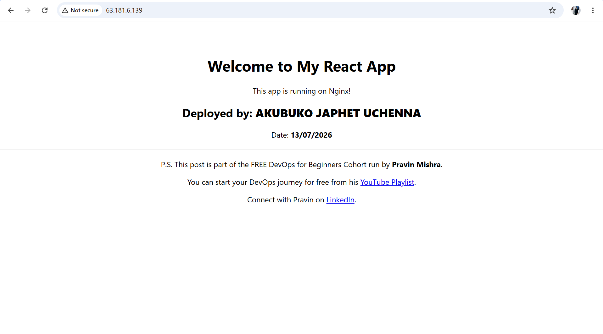

---

#### Screenshot 2 — Output of `ip a`

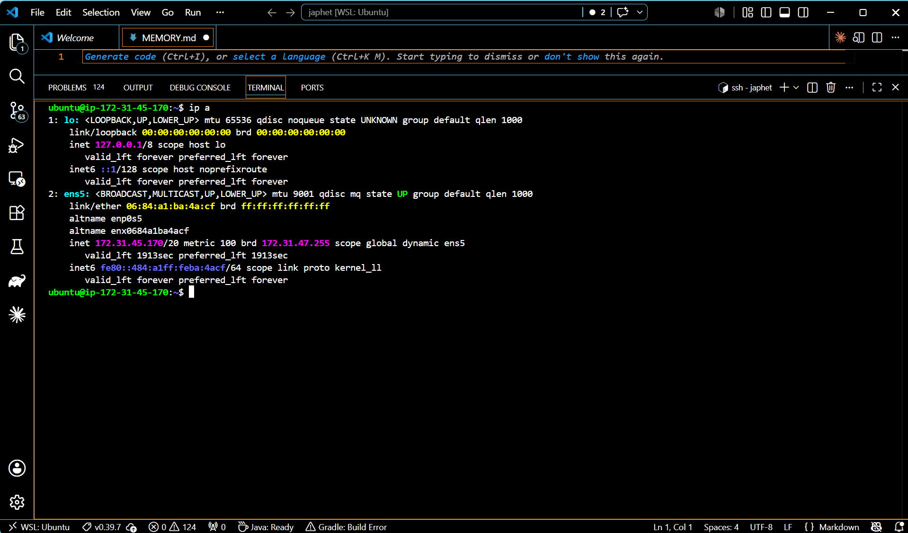

---

#### Screenshot 3 — Output of `sudo ss -tulpen`

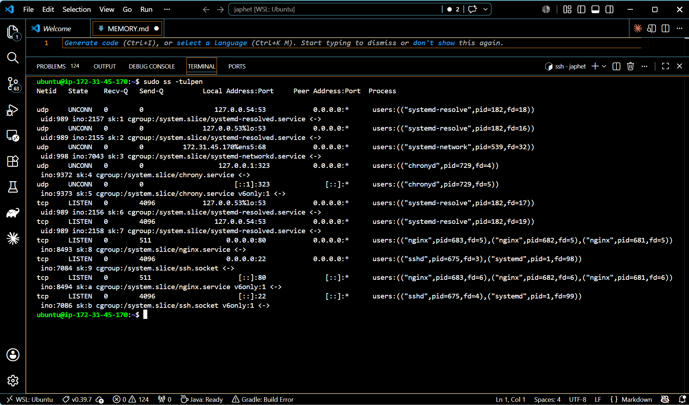

---

#### Screenshot 4 — Output of `sudo ufw status`

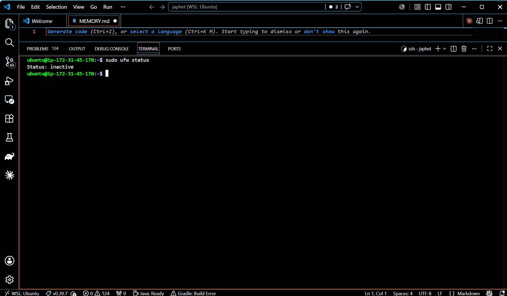

---

### Notes

Answer the following in your own words:

**1. What proves Nginx is listening on 0.0.0.0:80?**

The output of sudo `ss -tulpen` showed that Nginx was listening on 0.0.0.0:80 with the LISTEN state. This means the web server is accepting HTTP requests from any network interface, allowing users to access the React application through the server's public IP address.

---

**2. What proves SSH is active on port 22?**

The same sudo `ss -tulpen` command showed that sshd was listening on port 22. This confirmed that the SSH service was running correctly and the server was ready to accept secure remote connections for administration.

---

**3. Did you find any unexpected open ports? Explain briefly.**

No, I did not find any unexpected open ports. The server was listening only on the required ports, such as 22 for SSH and 80 for HTTP (Nginx). Keeping only the necessary ports open reduces the attack surface and is considered a good security practice for production servers.

---

# Task 2 — Service Health & Systemd Validation (Nginx)

## Goal

Verify that Nginx is properly installed, running, enabled at boot, and safely configured.

### Evidence

#### Screenshot 1 — Output of `systemctl status nginx --no-pager`

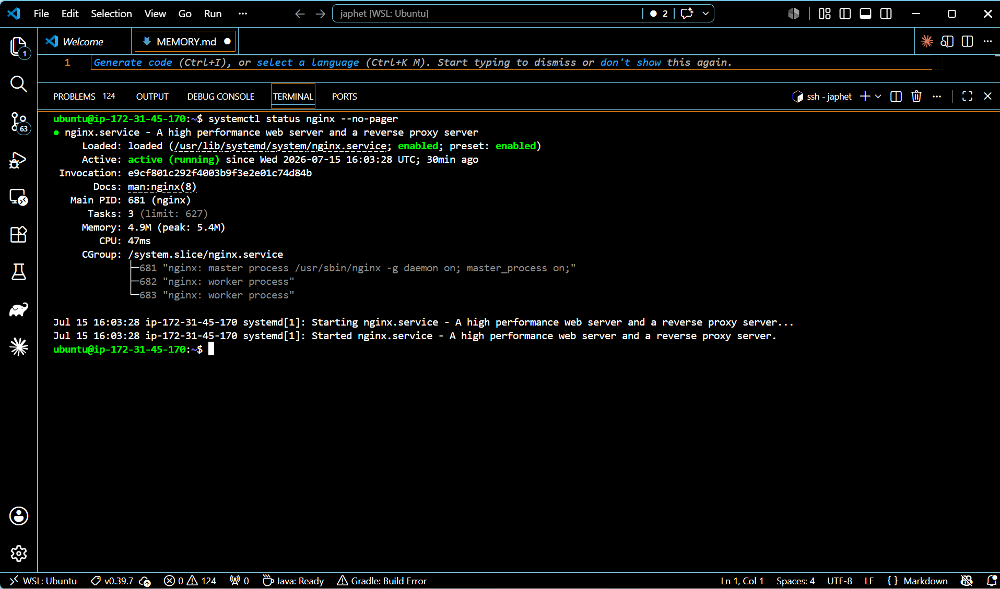

---

#### Screenshot 2 — Output of `sudo nginx -t`

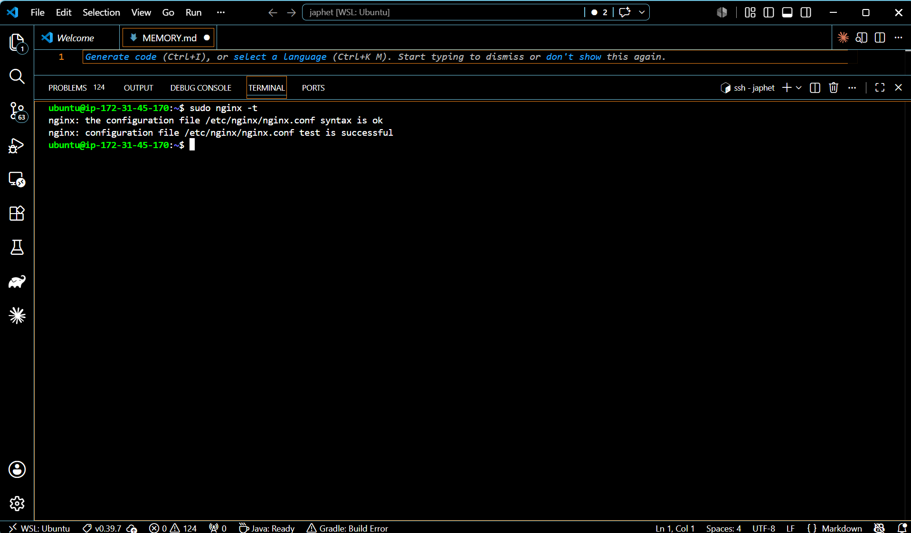

---

#### Screenshot 3 — Output of `sudo ss -lptn '( sport = :80 )'`

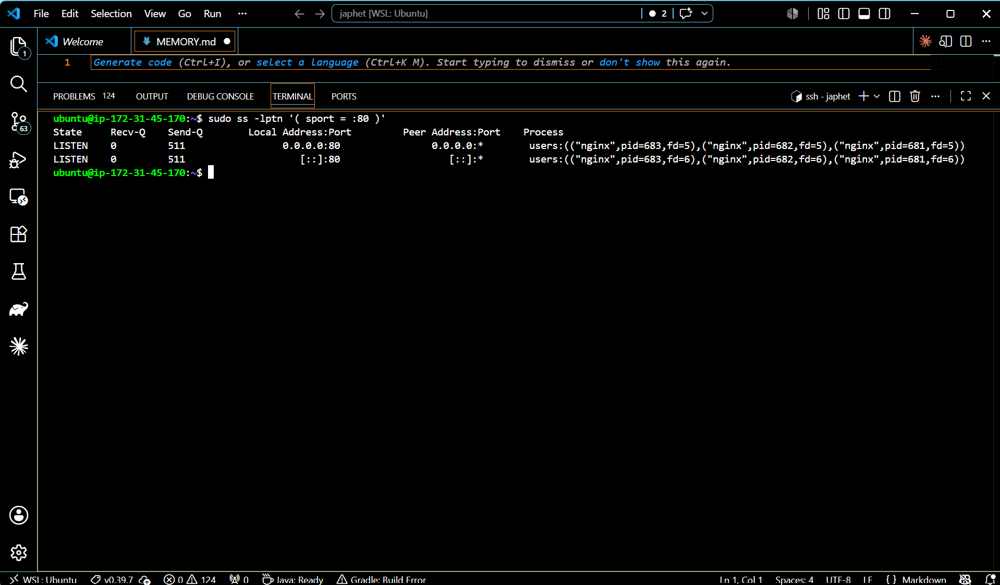

---

### Notes

Answer the following in your own words:

**1. What happens if Nginx fails to restart in production?**

If Nginx fails to restart, the website may become unavailable or users might see errors like 502 Bad Gateway or Connection Refused, depending on the issue. This can lead to downtime and affect the user experience. That's why it's important to test the configuration with `nginx -t` before restarting the service.

---

**2. What's your basic rollback plan?**

My first step would be to identify the recent change that caused the problem and restore the last working Nginx configuration. After that, I would validate the configuration using nginx -t and restart the service. If the issue still exists, I would restore the previous application or server backup to bring the website back online as quickly as possible.

---

# Task 3 — Logs & Request Trace

## Goal

Verify real traffic flow and analyze logs to understand system behavior and errors.

### Evidence

#### Screenshot 1 — Output of `sudo tail -n 30 /var/log/nginx/access.log`

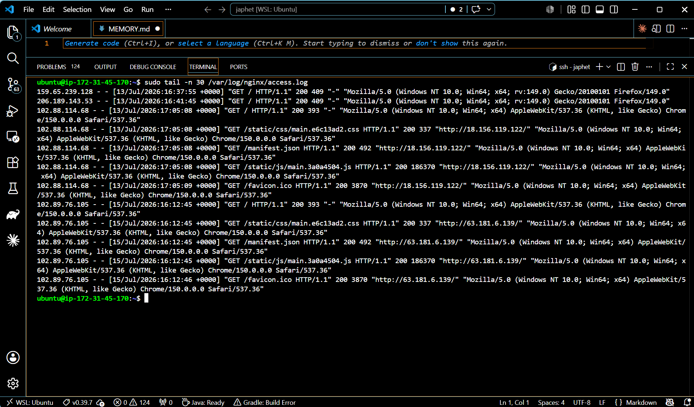

---

#### Screenshot 2 — Output of `sudo tail -n 30 /var/log/nginx/error.log`

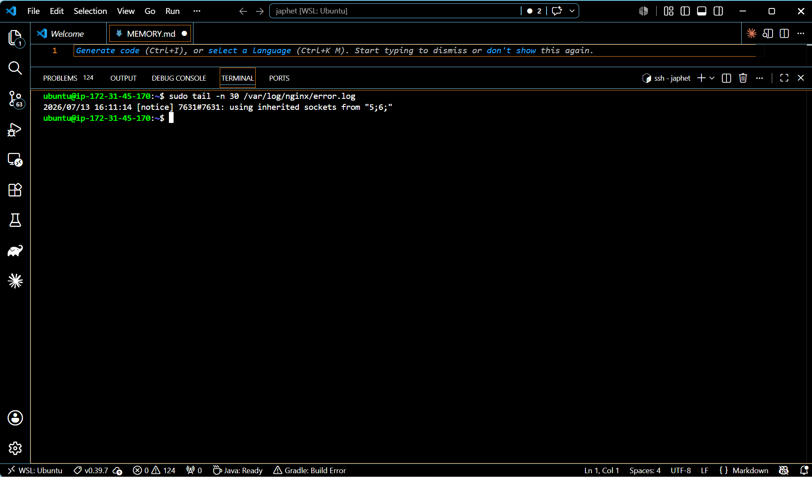

---

#### Screenshot 3 — Output of `sudo journalctl -u nginx --no-pager -n 50`

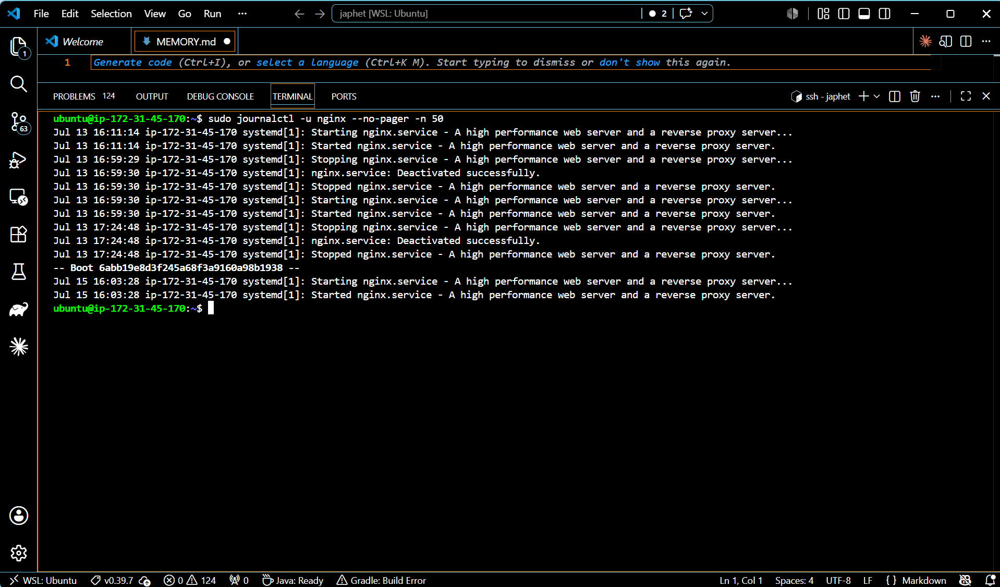

---

### Notes

Answer the following in your own words:

**1. Were there any errors in the logs?**

- If yes, mention 1–2 example error lines from the logs and explain what each one means in simple terms.
- If no, explain what it means if the error log is empty or shows no recent errors during your check.

No, I did not find any errors in the Nginx error logs during my analysis. The error log was empty (or did not contain any recent error entries), which indicates that no issues were recorded while I was checking the server. This doesn't guarantee that the application will never have problems, but it shows that the server was running normally during the time I analyzed the logs.

---

**2. If there were no errors, what does that indicate about the system?**

It indicates that the application and Nginx were working as expected during the monitoring period. Requests were being processed successfully, and there were no server-side errors recorded at that time. However, it's still important to monitor the logs regularly because new issues can occur at any time.

---

**3. Based on the access logs, were your curl requests visible in the log entries? What does that prove about traffic flow?**

Yes, my `curl` requests were visible in the Nginx access logs. This confirmed that the requests successfully reached the web server and were processed by Nginx. It also proved that the network connection, Nginx configuration, and request logging were all working correctly.

---

# Task 4 — System Resource Health Check (Capacity Red Flags)

## Goal

Assess server capacity and detect potential performance or failure risks.

### Evidence

#### Screenshot 1 — Output of `uptime`

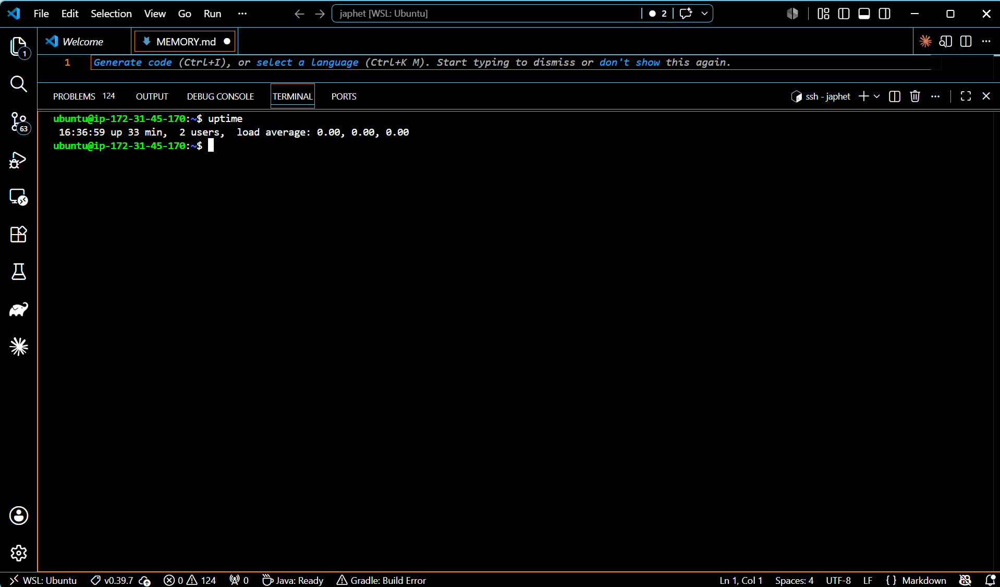

---

#### Screenshot 2 — Output of `free -h`

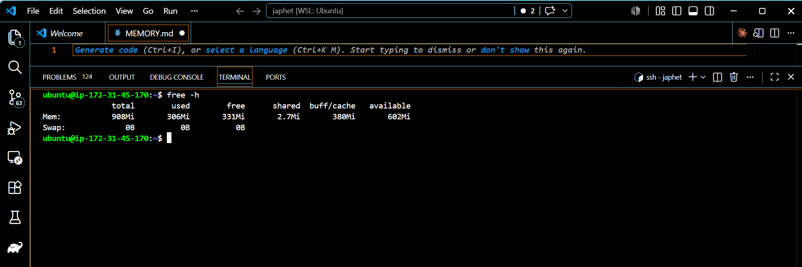

---

#### Screenshot 3 — Output of `df -h`

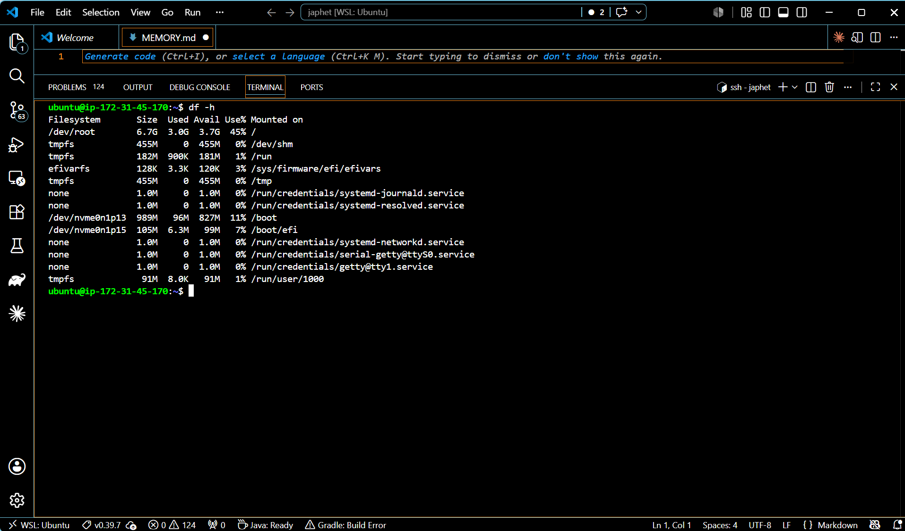

---

#### Screenshot 4 — Output of `sudo du -sh /var/* | sort -h`

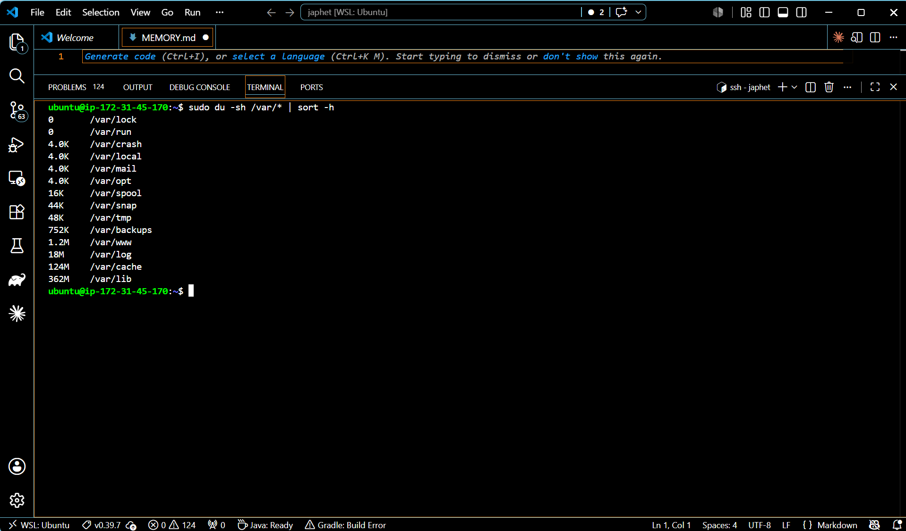

---

### Notes

Answer the following in your own words:

**1. Which resource looks most critical right now? (CPU/load, memory, or disk) Explain why.**

At the moment, none of the system resources appear to be in a critical state. However, if I had to choose one to monitor closely, I would pick disk usage. The root partition is currently using about 60% of its capacity, which is still safe, but disk space tends to fill up over time due to logs, application data, and updates. Regular monitoring helps prevent unexpected storage issues in production.

---

**2. What happens if disk becomes 100% full in a production server?**

If the disk becomes completely full, the server can start experiencing serious problems. Applications may fail to write new files, logs may stop being generated, updates or deployments can fail, and some services might even crash or refuse to start. In a production environment, this can lead to downtime and make troubleshooting much more difficult, so it's important to monitor disk usage and clean up unnecessary files before storage reaches its limit.

---

# Task 5 — Configuration & Deployment Verification

## Goal

Ensure the correct React build is deployed and Nginx is serving it properly.

### Evidence

#### Screenshot 1 — Output of `ls -lah /var/www/html | head -n 20`

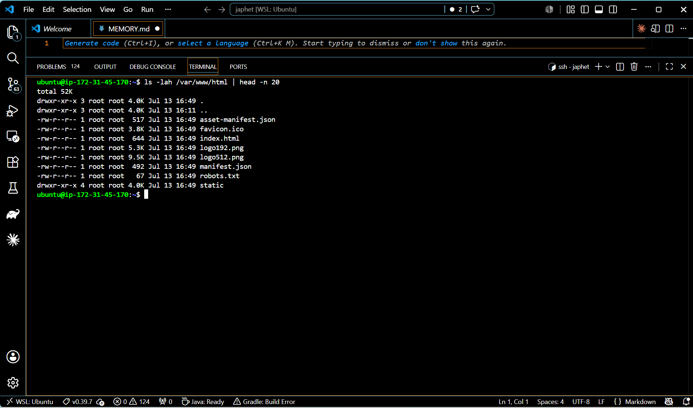

---

#### Screenshot 2 — Output of `grep -R "Deployed by" -n /var/www/html 2>/dev/null | head`

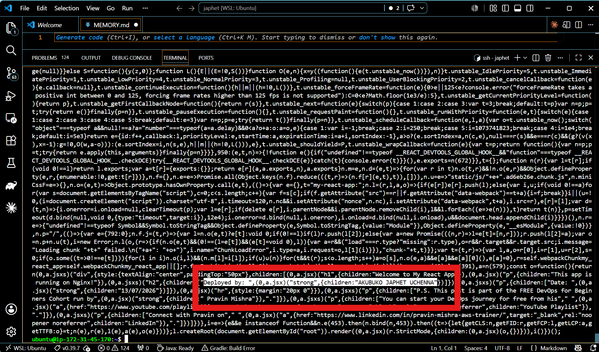

---

#### Screenshot 3 — Output of `grep -n "try_files" /etc/nginx/sites-available/default`

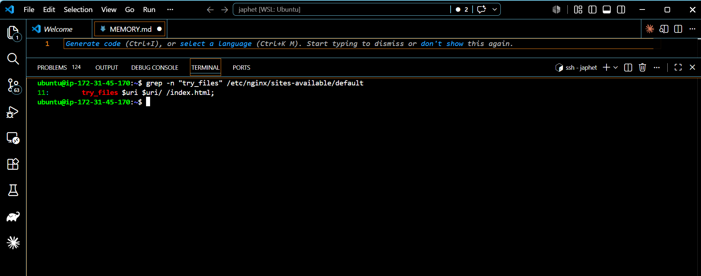

---

### Notes

Answer the following in your own words:

**1. How do you confirm that the correct version of the application is deployed?**

I confirmed the deployment by checking the contents of the `/var/www/html` directory using the `ls -lah` command and verified that the React build files, including `index.html` and the `static` folder, were present. I then searched for the "Deployed by Yash Rawat" text using the `grep` command, which confirmed that my personalized changes were included in the deployed build. Finally, I accessed the application in the browser using the EC2 instance's public IP and verified that the updated application loaded correctly, confirming that Nginx was serving the correct version from the expected web root.

---

# Task 6 — Nginx Configuration Failure Simulation

## Goal

Simulate a real-world Nginx misconfiguration and recover the service safely.

### Evidence

#### Screenshot 1 — Output of `sudo nginx -t` showing the syntax error (broken config)

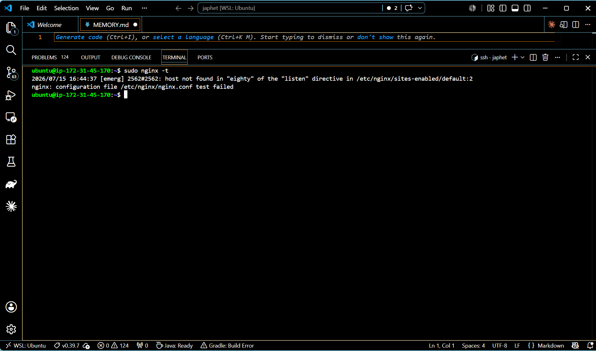

---

#### Screenshot 2 — Output of `sudo nginx -t` showing syntax ok (fixed config)

---

#### Screenshot 3 — Output of `curl -I http://<public-ip>` confirming recovery (200 OK)

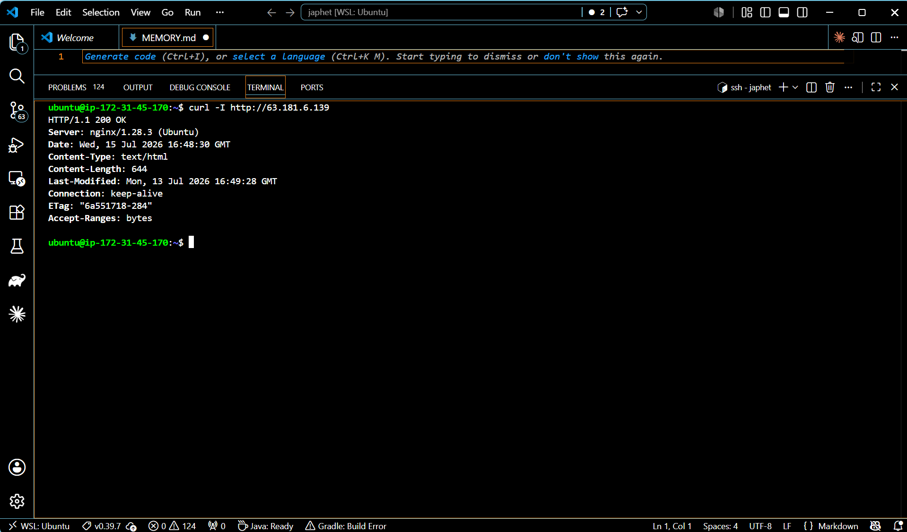

---

### Notes

Answer the following in your own words:

**1. What caused the configuration failure?**

The configuration failure happened because I intentionally removed the semicolon (`;`) from the `try_files $uri /index.html;` directive in the Nginx configuration file. This created a syntax error, so Nginx could not validate the configuration or restart successfully until the mistake was fixed.

---

**2. How did you fix the issue?**

I reopened the Nginx configuration file, added the missing semicolon back to the `try_files` directive, and saved the changes. After that, I verified the configuration using `sudo nginx -t`, which confirmed that the syntax was correct. Finally, I restarted the Nginx service and confirmed that the application was accessible again with an HTTP 200 response.

---

**3. How can you avoid this kind of issue in real production systems?**

To avoid this type of issue in a production environment, I would always validate the configuration with `nginx -t` before restarting or reloading Nginx. It's also a good practice to review configuration changes carefully, use version control to track modifications, and test changes in a staging environment before deploying them to production. These steps help catch configuration errors early and reduce the risk of downtime.

---

# Task 7 — Web Application Failure Simulation

## Goal

Simulate missing deployment content and recover the application safely.

### Evidence

#### Screenshot 1 — Output of `curl -I http://<public-ip>` showing failure (non-200 response)

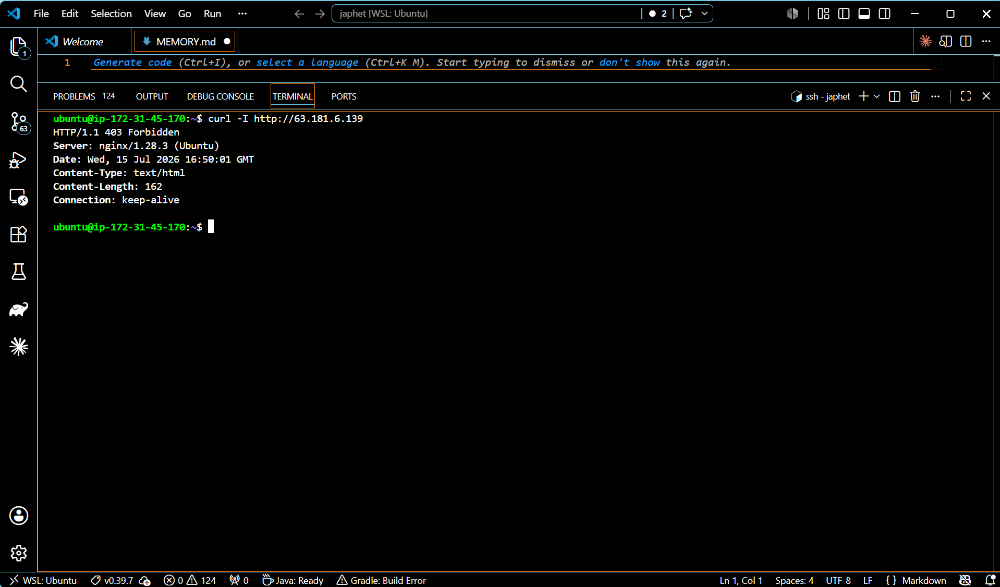

---

#### Screenshot 2 — Output of `curl -I http://<public-ip>` confirming recovery (200 OK)

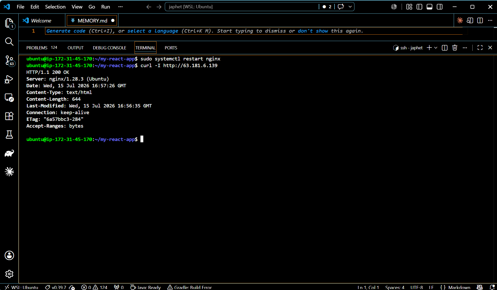

---

### Notes

Answer the following in your own words:

**1. What caused the application to break in this scenario?**

The application stopped working because the `/var/www/html` directory, which contains the deployed React application, was temporarily replaced with an empty directory. Since Nginx could no longer find the required application files like `index.html`, it was unable to serve the website correctly.

---

**2. How did you fix the issue and restore the application?**

I restored the original deployment by removing the empty `/var/www/html` directory and moving the backup directory back to its original location. After that, I restarted the Nginx service and verified the recovery by sending a request to the application's public IP. The server returned a successful HTTP 200 response, confirming that the application was working again.

---

**3. What steps would you take to prevent this kind of issue in real production systems?**

To prevent this type of issue, I would always take a backup before making any changes to the production environment. I would also use automated deployment pipelines with rollback support instead of making manual changes directly on the server. Testing changes in a staging environment, maintaining version-controlled deployments, and monitoring the application after deployment can further reduce the risk of downtime.

---

# Task 8 — Security & Reliability Review

## Goal

Review and reflect on the security and reliability practices applied during this assignment.

### Security & Reliability Notes

Answer the following in your own words:

**1. Why is SSH key-based authentication more secure than sharing passwords?**

SSH keys are much harder to guess or steal than passwords. They provide a more secure way to access the server and reduce the risk of unauthorized login.

---

**2. Why should only required ports be open on a production server?**

Keeping only the required ports open reduces security risks. It helps protect the server from unnecessary attacks.

---

**3. Why is it important for Nginx to be enabled on boot?**

If Nginx starts automatically after a reboot, the website becomes available without any manual work. This helps reduce downtime

---

**4. What are the risks of sharing secrets, keys, or credentials publicly?**

If someone gets access to your secrets or keys, they can log in to your systems, steal data, or misuse your cloud resources.

---

**5. Why should cloud resources be stopped or terminated when they are no longer needed?**

Unused cloud resources can still generate charges. Stopping or deleting them helps save money and keeps your cloud environment clean.

---

# LinkedIn Post (Required)

## Evidence

#### LinkedIn Post URL

Paste your LinkedIn post URL here:

`__________________________`

---

#### Screenshot — Published LinkedIn post

---

# Submission Instructions

- Add all required screenshots in your submission
- Full name must be visible in required screenshots
- Do not expose sensitive information (keys, passwords, account IDs)

---

# Completion Checklist

- [ ] Task 1: Screenshots (browser, ip a, ss -tulpen, ufw status) + Notes answered
- [ ] Task 2: Screenshots (nginx status, nginx -t, ss port 80) + Notes answered
- [ ] Task 3: Screenshots (access log, error log, journalctl) + Notes answered
- [ ] Task 4: Screenshots (uptime, free -h, df -h, du -sh) + Notes answered
- [ ] Task 5: Screenshots (ls html, grep deployed by, grep try_files) + Notes answered
- [ ] Task 6: Screenshots (nginx -t fail, nginx -t pass, curl recovery) + Notes answered
- [ ] Task 7: Screenshots (curl failure, curl recovery) + Notes answered
- [ ] Task 8: Security & Reliability Notes answered
- [ ] LinkedIn post published and URL submitted
- [ ] Full Name visible in all required screenshots
- [ ] No sensitive data exposed

---

## 📌 About DMI & CloudAdvisory

DevOps Micro Internship (DMI) is a project-based DevOps program run by Pravin Mishra (The CloudAdvisory) focused on real-world execution, systems thinking, and career readiness.

It helps learners build strong DevOps foundations with hands-on experience.

---

## 📌 Resources

- 🌐 DMI Official Website: https://pravinmishra.com/dmi  
- 🎓 DevOps for Beginners (Udemy): https://www.udemy.com/course/devops-for-beginners-docker-k8s-cloud-cicd-4-projects/  
- 🎓 Agentic AI DevOps with Claude Code: https://www.udemy.com/course/ultimate-agentic-ai-devops-with-claude-code/  
- 🎓 DevOps with Claude Code: Terraform, EKS, ArgoCD & Helm: https://www.udemy.com/course/devops-with-claude-code-terraform-eks-argocd-helm/  
- ▶️ YouTube Playlist: https://www.youtube.com/playlist?list=PLFeSNDtI4Cho  
- 🔗 Pravin Mishra (LinkedIn): https://www.linkedin.com/in/pravin-mishra-aws-trainer/  
- 🏢 CloudAdvisory (LinkedIn): https://www.linkedin.com/company/thecloudadvisory/

---

*This submission is part of DevOps Micro Internship (DMI) Cohort 3 — Agentic AI Track.*
