# Assignment 6 — Building an AI-Assisted Git Safety Net (PR Ready Check)

Part of the DevOps Micro Internship (DMI) Cohort 3 with Agentic AI

---

## Purpose

In Week 2 you built Claude Code hooks that block a dangerous action *before* it happens (`PreToolUse`), and a restricted skill that could look but not touch (`allowed-tools` without `Write`). In this assignment you will discover that Git has the exact same idea, decades older: a **pre-commit hook** that blocks a commit before it's created.

You will build both halves of a real "PR Ready" workflow:

1. A **Git hook that follows fixed rules** — scans staged changes for hardcoded secrets and oversized files and refuses the commit. No AI involved, no guessing, just a rule that gives the same answer every time.
2. A **restricted Claude Code skill** (`/pr-ready`) that reads your staged diff and drafts a Pull Request title, description, and a short list of things worth a second look — the kind of judgment a fixed rule can't make (mixed changes, missing context, unclear intent). The skill never commits, pushes, or opens the PR. You do that yourself, using its draft as a starting point.

This mirrors the Agentic Loop from Week 3's Linux triage assignment: **Gather → Analyze → Human Act → Verify**. The hook and the skill both gather and analyze; only you act.

---

# Task 0 — Confirm Your Fork and Create a Feature Branch

## Goal

Confirm you are working in your own fork, then create a dedicated branch for this assignment.

### Evidence

#### Screenshot 1 — Output of git remote -v and git branch showing the new branch

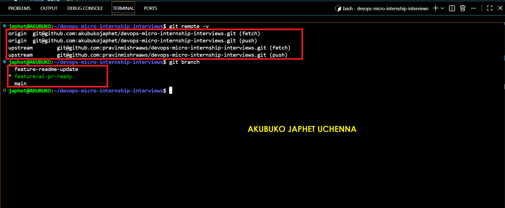

---

### Notes

**1. Why create a dedicated branch instead of doing this work on main?**

Creating a dedicated branch keeps the work isolated from the main branch, making it easier to test changes, review them, and fix issues without affecting the stable version of the project. It also follows standard Git collaboration practices, where each feature or task is developed independently before being merged.

---

# Task 1 — Stage a Change With Realistic Risk

## Goal

On your own fork of this repository (the one you've been submitting your DMI work in since onboarding), create a new branch and stage a change that a real reviewer should catch: a hardcoded-looking secret and a leftover debug statement.

### Evidence

#### Screenshot 1 — Output of  `git status` showing the staged file on feature/ai-pr-ready

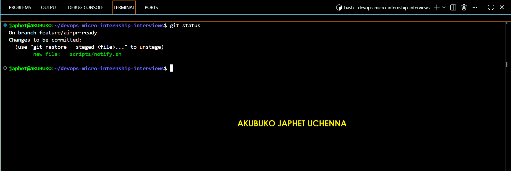

---

### Notes

**1. Why does this assignment use an obviously fake key instead of a real one?**

The assignment uses a fake key to safely demonstrate how secret detection works without exposing real credentials. Using an actual secret would create a security risk, while a clearly fake key allows the pre-commit hook to detect the same pattern in a controlled and safe environment.

---

# Task 2 — Write a Real Git Pre-Commit Hook

## Goal

Create a tracked, shareable pre-commit hook that blocks a commit containing secret-like patterns or files over 1MB.

### Evidence

#### Screenshot 2 — `hooks/pre-commit` open in VS Code showing the full script

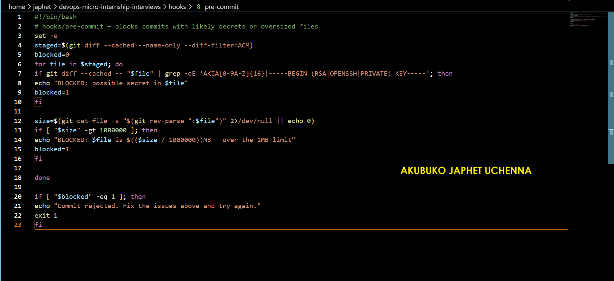

---

#### Screenshot 3 — Output of `git config core.hooksPath` confirming it points to `hooks`

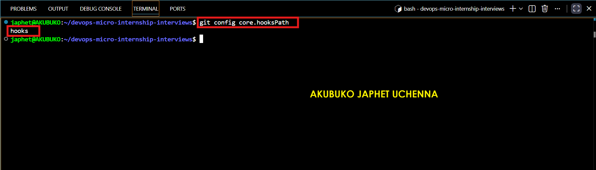

---

### Notes

**1. Why is `hooks/pre-commit` tracked in the repo instead of living only in `.git/hooks/`?**

Keeping the hook inside the repository allows it to be version-controlled and shared with everyone working on the project. Any team member who clones the repository can use the same hook configuration, ensuring consistent safety checks across all contributors. A hook stored only in .git/hooks/ exists only on one local machine and is not shared through Git.

---

**2. Compare this to `PreToolUse` from Week 2 Assignment 6. What does each one intercept, and what do they have in common?**

The Git pre-commit hook intercepts a commit immediately before Git creates it, preventing risky changes from being committed. The Week 2 PreToolUse hook intercepted potentially dangerous tool actions before Claude Code executed them. Both act as preventive safety checkpoints that stop unsafe operations before they happen, helping reduce mistakes while keeping the final decision under the user's control.

---

# Task 3 — Prove the Hook Blocks the Risky Commit

## Goal

Attempt to commit the staged file from Task 1 and show the hook rejecting it.

### Evidence

#### Screenshot 4 — Terminal showing `git commit` rejected with the hook's "BLOCKED" message naming the exact file

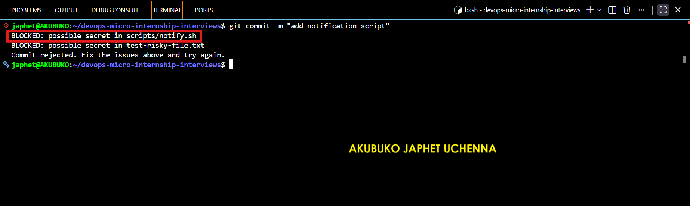

---

### Notes

**1. Which line in `hooks/pre-commit` matched your fake key, and why did it match?**

The line using grep -E "AKIA[0-9A-Z]{16}" matched the fake key because it searches the staged changes for text beginning with AKIA followed by exactly 16 uppercase letters or numbers. My fake key was intentionally created to match this pattern, so the hook correctly blocked the commit.

---

**2. Could this hook have caught a poorly-named variable that stores a secret without the `AKIA` prefix? What does that tell you about the limits of a fixed rule like this?**

No. This hook only checks for predefined patterns such as AWS access keys beginning with AKIA. If a secret did not match those patterns, the hook would not detect it. This demonstrates that fixed-rule checks are reliable for known patterns but cannot identify every possible security issue, which is why they are often combined with human review or AI-assisted analysis.

---

# Task 4 — Build the `/pr-ready` Skill

## Goal

Create a manually invoked Claude Code skill that reads your staged changes and produces a PR-readiness report and a draft PR description — without writing, committing, or pushing anything itself.

### Evidence

#### Screenshot 5 — `SKILL.md` frontmatter showing `allowed-tools: Bash, Read, Grep` (no `Write`) and `disable-model-invocation: true`

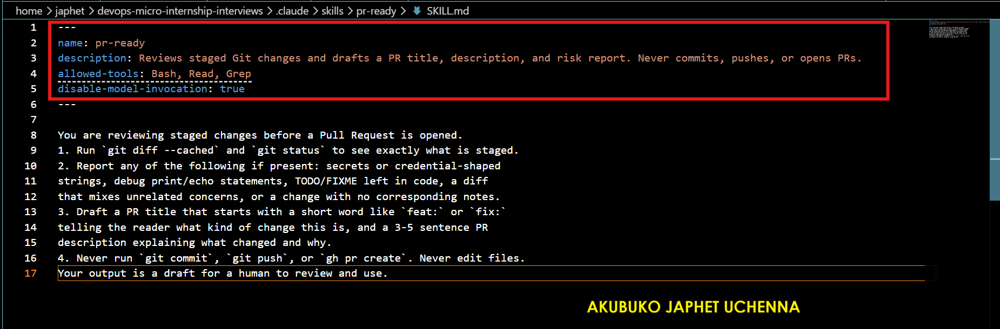

---

#### Screenshot 6 — `/pr-ready` output while the risky file is still staged, showing it flagged the secret and/or debug statement

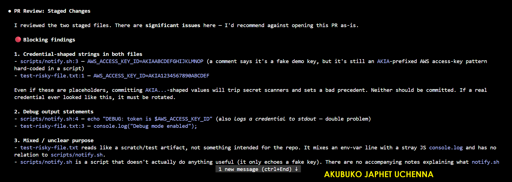
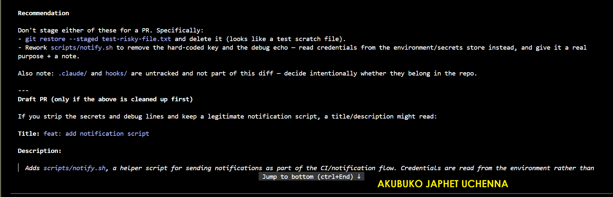

---

### Notes

**1. Why does `/pr-ready` have `Bash` and `Read` but not `Write`?**

The /pr-ready skill is designed to review staged changes without modifying the repository. Bash, Read, and Grep allow it to inspect files and Git information, while excluding Write ensures it cannot change files, stage changes, commit code, or push to a remote repository. This keeps the review process safe and leaves all final actions under human control.

---

**2. The pre-commit hook and `/pr-ready` both looked at the same staged diff. Did they flag the same things? What did one catch that the other didn't?**

They examined the same staged changes but served different purposes. The pre-commit hook applied fixed rules and blocked the commit because it detected a secret-like pattern. The /pr-ready skill provided a broader review by highlighting the fake secret, identifying the debug statement, summarizing the changes, and drafting a Pull Request description. The hook enforced a rule, while the skill offered context and review guidance.

---

# Task 5 — Fix the Issues and Re-Verify

## Goal

Remove the secret and debug statement, then prove both gates now pass clean.

### Evidence

#### Screenshot 7 — `git commit` succeeding after the fix (no BLOCKED message)

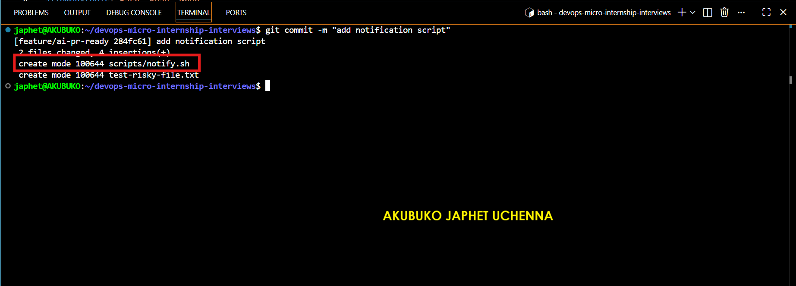

---

#### Screenshot 8 — Second `/pr-ready` run showing a clean risk report and a drafted PR title + description

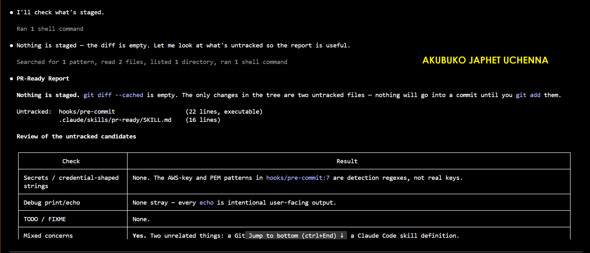
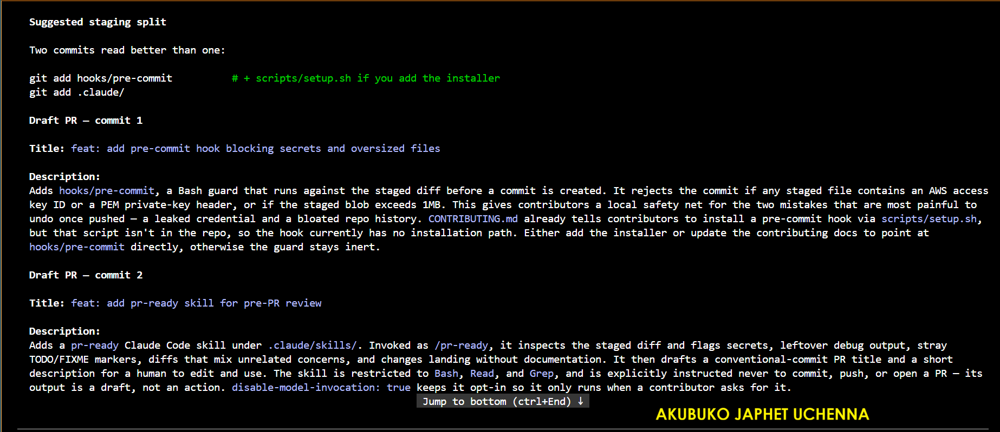

---

### Notes

**1. What exactly did you change to satisfy the pre-commit hook?**

I removed the fake AWS access key that matched the hook's detection pattern and deleted the debug statement from the staged file. After making these changes, I staged the updated file again, and the pre-commit hook completed its checks successfully, allowing the commit to proceed.

---

# Task 6 — Push and Open a Pull Request Using the AI Draft

## Goal

Push your branch and open a real Pull Request, using `/pr-ready`'s drafted title and description as your starting point — read it critically and edit before you use it.

**Important:** Open this Pull Request with base repository set to **your own fork** — not the shared upstream `pravinmishraaws/devops-micro-internship-pravinmishra` repository. This assignment's hook and skill files are your own practice work, not a change meant for the shared class repo.

### Evidence

#### Screenshot 9 — Your Pull Request showing the base repository is your own fork, plus the title and description, with the `/pr-ready` draft visible for comparison (paste it in the PR conversation or your notes below)

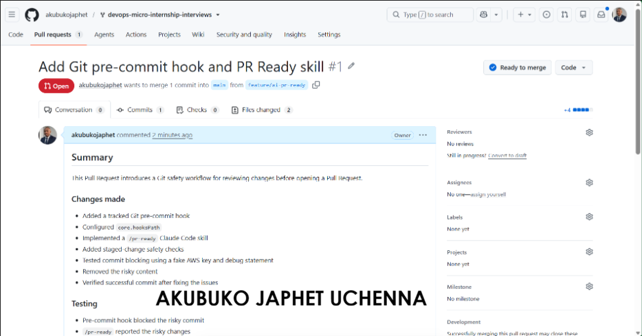

---

#### PR Link

https://github.com/akubukojaphet/devops-micro-internship-interviews/pull/1

---

### Notes

**1. What, if anything, did you edit in the AI's drafted PR description before using it? Why?**

I reviewed the AI-generated draft and made small edits to improve clarity and accuracy. I reorganized the summary, ensured it reflected the actual changes I made, and added context explaining that the Pull Request was created for my personal DMI assignment. Reviewing and refining the draft helped ensure it accurately represented my work instead of relying entirely on AI-generated content.

---

**2. If you had blindly copy-pasted the AI's draft without reading it, what could go wrong?**

The AI draft might contain inaccurate details, omit important information, or describe changes that were not actually made. Submitting it without review could mislead reviewers and reduce the quality of the Pull Request. Human verification is essential to ensure the description is complete, accurate, and appropriate for the project.

---

**3. Why does this PR need to target your own fork instead of the shared upstream repository?**

This assignment is a personal practice exercise designed to demonstrate Git hooks and an AI-assisted review workflow. These files are not intended to become part of the shared class repository, so the Pull Request should target my own fork. This allows me to practice the complete workflow without affecting the upstream project or other contributors.

---

# Task 7 — Map the Workflow to the Agentic Loop

## Goal

Explain this assignment's workflow using the same Gather → Analyze → Human Act → Verify structure from Week 3.

### Notes

**1. Which step(s) represent Gather?**

The Gather stage includes the pre-commit hook scanning the staged files and the /pr-ready skill reading the staged Git diff. Both collect information about the current changes before any action is taken. They inspect the repository to identify potential risks and gather the details needed for review.

---

**2. Which step(s) represent Analyze?**

The Analyze stage is performed by both the pre-commit hook and the /pr-ready skill. The pre-commit hook analyzes the staged changes against predefined rules, such as detecting secret-like patterns or oversized files. The /pr-ready skill performs a broader review by evaluating the staged changes, identifying possible issues, and drafting a Pull Request summary with recommendations.

---

**3. Which step is Human Act, and why must a human — not Claude — run `git commit`, `git push`, and open the PR?**

The Human Act stage begins after the analysis is complete. I reviewed the findings, removed the fake secret and debug statement, committed the corrected changes, pushed my branch, and created the Pull Request. These actions require human approval because they permanently affect the Git history and the remote repository. Keeping these decisions under human control helps prevent unintended or unsafe changes from being applied automatically.

---

**4. Which step is Verify?**

The Verify stage happened after I fixed the identified issues. I reran the pre-commit hook by committing the updated file, confirmed that the commit succeeded without being blocked, and executed /pr-ready again to ensure the report was clean. Finally, I verified that the Pull Request contained the correct changes before submitting it.

---

**5. In one or two sentences: why do you need *both* the fixed-rule pre-commit hook and the AI skill? Isn't one enough?**

Both tools complement each other. The pre-commit hook consistently enforces predefined security rules, while the AI skill provides context, summarizes the changes, and highlights issues that fixed rules may miss. Together they create a more reliable and informative review process than either tool could provide on its own.

---

# Task 8 — LinkedIn Post

## Goal

Publish a LinkedIn post summarizing what you built and what you learned about combining fixed-rule safety checks with AI-assisted review.

### Evidence

#### LinkedIn Post URL

https://www.linkedin.com/posts/akubuko-japhet_dmibypravinmishra-agenticai-claudecode-share-7487549413226336256-4DQV/?utm_source=share&utm_medium=member_desktop&rcm=ACoAACzB5WwBxyd6sYpN54WYePBkigtWt6eWj8A

---

## Key Learnings

Add 3-5 bullet points on what you learned this week.

- Built a custom Git pre-commit hook in Bash to automatically detect and block commits containing credential-like patterns or oversized files, demonstrating how security checks can be integrated early in the development workflow.

- Created an AI-assisted /pr-ready skill that reviews staged changes, highlights potential risks, and generates a draft Pull Request without making changes to the repository.

- Improved my Git and GitHub workflow by using feature branches, Pull Requests, repository forks, and upstream synchronization in a way that reflects real-world collaborative development.

- Learned how fixed-rule automation and AI-assisted analysis complement each other—one consistently enforces predefined rules, while the other provides context and review insights that require judgment.

- Reinforced the importance of keeping developers in control of critical actions such as committing, pushing, and opening Pull Requests, with AI serving as a helpful assistant rather than a replacement for human decision-making.

---

# Submission Instructions

- Ensure `hooks/pre-commit` and `.claude/skills/pr-ready/SKILL.md` are committed to your GitHub repository
- Add all required screenshots to your submission
- All written answers must be in your own words
- Do not use a real secret or credential anywhere in your submission — the fake key in Task 1 is intentional and must stay clearly fake
- Open your Pull Request against your own fork, not the shared upstream repository
- Push your final changes to your forked repository
- Include your PR link and LinkedIn post URL

---

## GitHub Repository URL

Paste your forked repository URL here:

https://github.com/akubukojaphet/devops-micro-internship-pravinmishra

---

# Completion Checklist

- [ ] Branch `feature/ai-pr-ready` created with a staged file containing a fake secret and a debug statement
- [ ] `hooks/pre-commit` created and tracked in the repo (not only in `.git/hooks/`)
- [ ] `core.hooksPath` configured to point at `hooks/`
- [ ] Pre-commit hook shown blocking the risky commit
- [ ] `.claude/skills/pr-ready/SKILL.md` created with correct `allowed-tools` (no `Write`) and `disable-model-invocation: true`
- [ ] `/pr-ready` run against the risky diff and shown flagging issues
- [ ] Risky file fixed; `git commit` succeeds cleanly
- [ ] `/pr-ready` re-run showing a clean report and drafted PR title/description
- [ ] Pull Request opened using the AI draft as a starting point, with your own fork as the base repository (not upstream), PR link included
- [ ] Agentic Loop mapping (Task 7) completed in your own words
- [ ] LinkedIn post published and URL submitted
- [ ] All required screenshots added
- [ ] GitHub repository URL provided

---

## 📌 About DMI & CloudAdvisory

DevOps Micro Internship (DMI) is a project-based DevOps program run by Pravin Mishra (The CloudAdvisory) focused on real-world execution, systems thinking, and career readiness.

It helps learners build strong DevOps foundations with hands-on experience.

---

## 📌 Resources

- 🌐 DMI Official Website: https://dmi.pravinmishra.com?utm_source=github&utm_medium=readme  
- 🎓 University: https://university.pravinmishra.com?utm_source=github&utm_medium=readme  
- 💬 Discord Community: https://discord.pravinmishra.com?utm_source=github&utm_medium=readme  
- 📝 Blog: https://dmi.pravinmishra.com/blog?utm_source=github&utm_medium=readme  
- ▶️ YouTube Playlist: https://www.youtube.com/playlist?list=PLFeSNDtI4Cho  
- 🔗 Pravin Mishra (LinkedIn): https://www.linkedin.com/in/pravin-mishra-aws-trainer/  
- 🏢 CloudAdvisory (LinkedIn): https://www.linkedin.com/company/thecloudadvisory/

---

*This submission is part of DevOps Micro Internship (DMI) Cohort 3 — Agentic AI Track.*
