# Assignment 5 — AI-Assisted Sprint Health Report via Jira MCP

Part of the DevOps Micro Internship (DMI) Cohort 3 with Agentic AI

---

## Purpose

In this assignment, you will connect Claude Code to your Jira board through an MCP server, the same way you connected it to GitHub in Week 2, and build a read-only `/sprint-health` skill. The skill reads your current sprint through Jira's API and reports sprint velocity, stories at risk of missing the sprint, and items missing an estimate — but it must never create, edit, comment on, or transition a single ticket itself. You will prove that boundary holds by making a real change on the board yourself and confirming the skill only ever reports, never acts.

---

# Task 1 — Create a Jira API Token

## Goal

Generate an API token from your Atlassian account that the MCP server will use to authenticate with your Jira site. Do not screenshot the token value itself.

### Evidence

#### Screenshot 1 — Jira API token creation confirmation page showing the token name, with the token value not visible

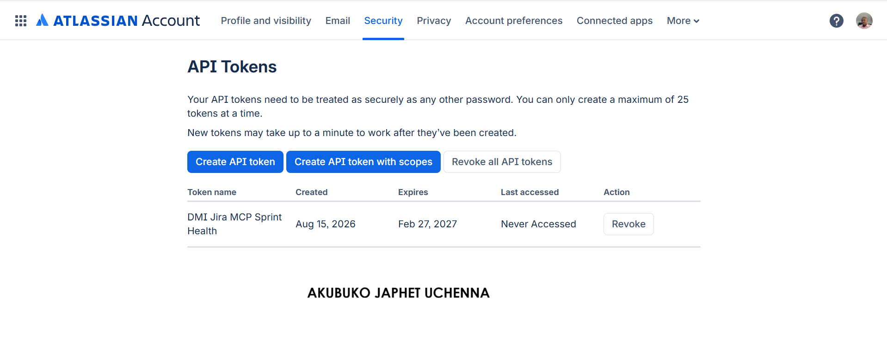

### Notes You Must Write (Very Important):

Why does the MCP server need your site URL and account email in addition to the token?

The Jira MCP server needs the Jira site URL so it knows which Jira Cloud instance to connect to. It needs the account email because the Jira API token is associated with a specific Atlassian account and the email identifies that account during authentication. The API token then acts as the credential used to authenticate the request. Together, the site URL, account email, and API token allow the MCP server to securely access my Jira data.

---

# Task 2 — Create .mcp.json at the Project Root

## Goal

Create or update `.mcp.json` at your project root with a Jira MCP server block, following the same shape as the GitHub MCP server you configured in Week 2.

### Evidence

#### Screenshot 2 — `.mcp.json` open in VS Code showing the Jira server configuration

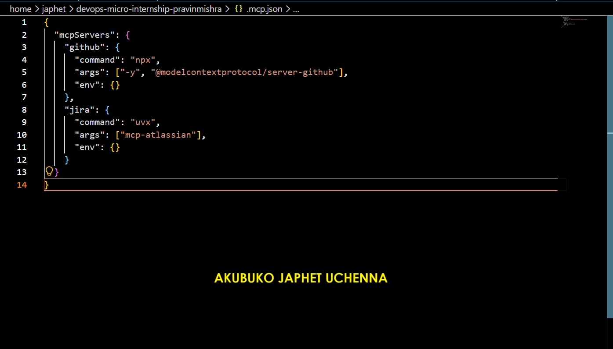

### Notes You Must Write (Very Important):

Compare this jira block to the github block from Week 2 Assignment 5. The GitHub server ran via npx (a Node.js package); this one runs via uvx (a Python package) — what stays exactly the same shape despite that difference, and why doesn't Claude Code care which language a given MCP server is written in?

The Jira MCP block follows the same basic structure as the GitHub MCP block from Week 2 Assignment 5. Both define the MCP server name, the command used to start the server, the arguments passed to that command, and an environment section.

The main difference is the command used to launch the server. The GitHub MCP server uses npx, which runs a Node.js package, while the Jira MCP server uses uvx, which runs a Python package.

Claude Code does not care which programming language the MCP server is written in because MCP provides a standard interface for communication between Claude Code and the server. As long as the MCP server follows that protocol and can be started using the configured command, Claude Code can communicate with it in the same way.

---

# Task 3 — Add Your Credentials to settings.local.json

## Goal

Add your Jira site URL, account email, and API token to `.claude/settings.local.json`, and confirm that file is listed in `.gitignore` so it is never committed.

### Evidence

#### Screenshot 3 — `settings.local.json` open in VS Code showing the `env` section, with the actual token value blurred or covered

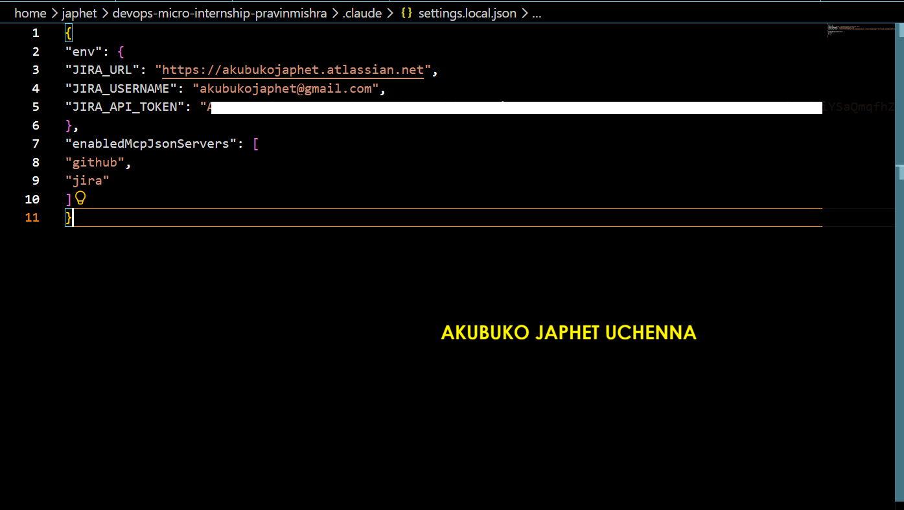

### Notes You Must Write (Very Important):

Why must JIRA_API_TOKEN live in settings.local.json and never in .mcp.json?

JIRA_API_TOKEN is a secret credential that allows access to my Jira account, so it must be kept in a local settings file that is excluded from Git. The .mcp.json file defines how the MCP server starts, while settings.local.json provides sensitive local environment variables. Keeping the token in settings.local.json prevents the secret from being committed to the repository or exposed to other people. This separation also allows the same .mcp.json configuration to be shared without exposing personal credentials.

---

# Task 4 — Verify the Connection with /mcp

## Goal

Restart Claude Code and confirm the Jira MCP server shows as connected.

### Evidence

#### Screenshot 4 — `/mcp` output showing `jira: connected`

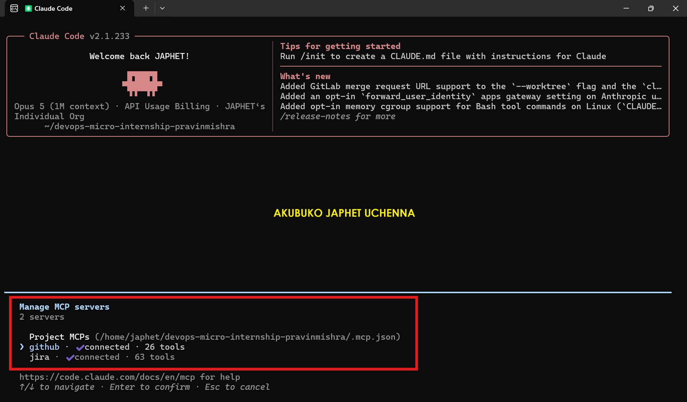

---

# Task 5 — Run a Live Query to Prove Real Board Data

## Goal

Ask Claude to list the issues in your current active sprint through the Jira MCP connection, and confirm the result matches what you see on your live board in the browser.

### Evidence

#### Screenshot 5 — Claude's response showing the live sprint issue list retrieved via Jira MCP

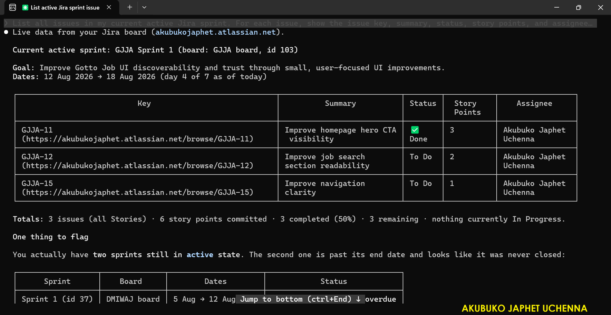
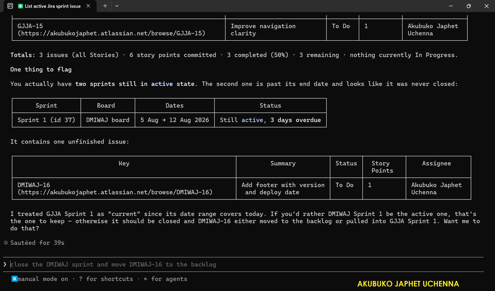

### Notes You Must Write (Very Important):

How did you confirm this was real board data and not something Claude guessed?

I confirmed the data was real board data by comparing the issue keys, summaries, statuses, story points, and assignees returned by Claude with the issues currently displayed on my Jira board. The information matched the live Jira board, confirming that the data was retrieved through the Jira MCP connection rather than being guessed.

---

# Task 6 — Build the /sprint-health Skill

## Goal

Create a `/sprint-health` skill restricted to read-only Jira tools plus `Read`, with no issue-mutating tools and no `Write`. Run it and confirm it produces a report covering sprint velocity, at-risk stories, and items missing an estimate.

### Evidence

#### Screenshot 6 — `SKILL.md` frontmatter showing `allowed-tools` limited to read-only Jira tools plus `Read`, with `disable-model-invocation: true`

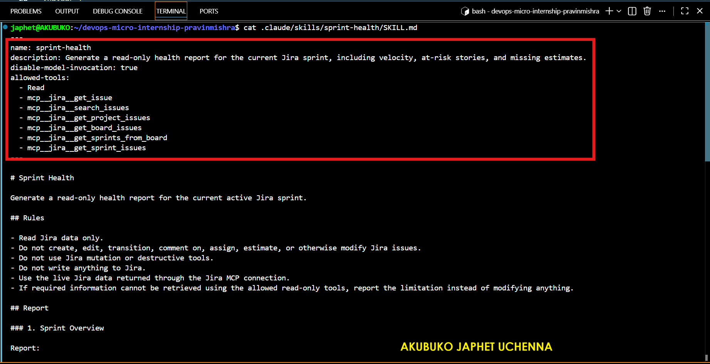

#### Screenshot 7 — `/sprint-health` output showing the full triage report against your real sprint

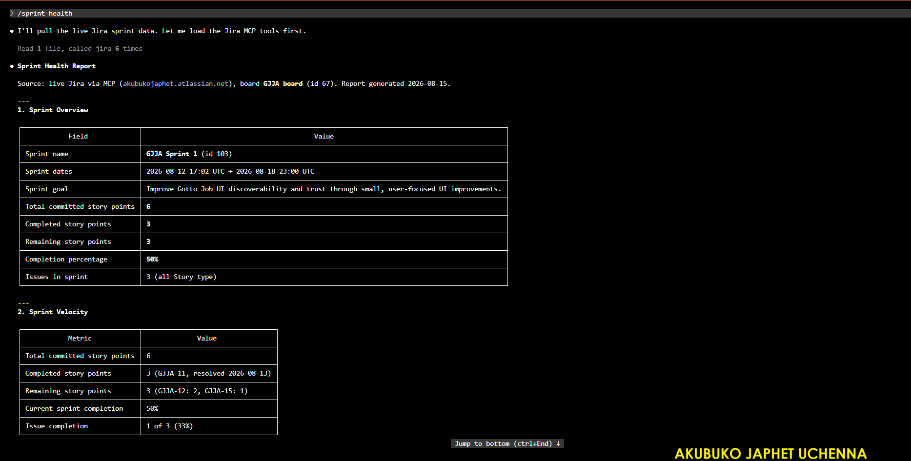
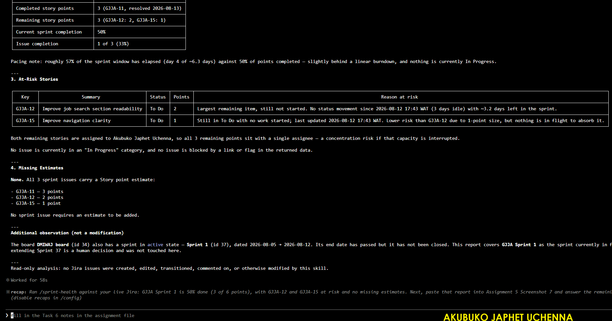

### Notes You Must Write (Very Important):

1. Which Jira MCP tools does this skill's allowed-tools list include, and which mutating tools (create issue, update issue, transition issue, add comment) does it deliberately exclude?

The skill allows five Jira tools plus `Read`:

- `mcp__jira__jira_get_agile_boards` to locate the board
- `mcp__jira__jira_get_sprints_from_board` to find the active sprint
- `mcp__jira__jira_get_sprint_issues` to retrieve its contents
- `mcp__jira__jira_search` for supplementary JQL
- `mcp__jira__jira_get_issue` for detail on individual issues

It excludes all 25 mutating tools the server exposes, including `jira_create_issue`, `jira_update_issue`, `jira_transition_issue`, `jira_add_comment`, `jira_delete_issue`, `jira_assign_issue`, `jira_move_issue`, `jira_link_to_epic`, `jira_add_issues_to_sprint`, `jira_create_sprint` and `jira_update_sprint`.

Two exclusions were judgement calls rather than obvious ones, and they are the interesting part.

`jira_download_attachments` is read-only as far as Jira is concerned, but it writes files to local disk. It fails the boundary for a different reason than the mutating tools do, which means "read-only" is not a single property.
`jira_get_transitions` changes nothing at all. It only lists which transitions are available. I excluded it anyway, because a skill that will never perform a transition has no reason to enumerate them. Keeping it would have been harmless and would also have been dishonest about the skill's intent.

More broadly, I allowed 5 tools out of 38 available read-only ones. Read-only is the floor, not the target. A report that could also read every service desk queue and every user profile would be over-permissioned even though nothing it could do is destructive.

`Write` is omitted entirely, so the skill cannot write to local disk either.

2. Why does a Scrum Master need this restriction more than almost any other role in this course?

A Scrum Master needs this restriction because the role is responsible for facilitating the Scrum process, transparency, inspection, and adaptation, not making changes to the team's work on their behalf. The skill should identify sprint health, risks, and missing estimates while leaving decisions and board changes to the human Scrum team. This prevents automation from silently changing sprint state and preserves human accountability for Scrum decisions.

---

# Task 7 — Prove the Skill Never Mutates the Board

## Goal

Manually update one ticket on your board in the browser (for example, move a story to "Done" or add a missing estimate), then run `/sprint-health` again and confirm the new report reflects your change — proving the skill only ever reads live state and never wrote to the board itself.

### Evidence

#### Screenshot 8 — Second `/sprint-health` run showing the report now reflects your manual board change

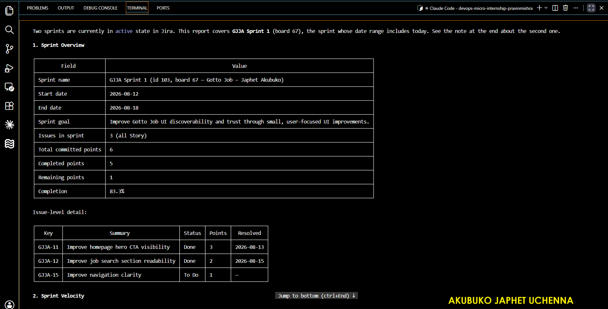
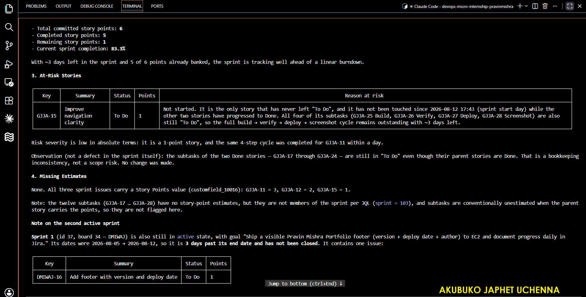

### Notes You Must Write (Very Important):

Map this assignment to Gather → Analyze → Human Act → Verify from Week 3 Assignment 6. Which step did you perform manually in the browser, and why must that step stay human?

**Gather.** The skill retrieved board metadata, the active sprint, its issues and their sub-tasks through four read-only tools. No interpretation, just collection.

**Analyze.** It computed elapsed time against completed points, evaluated four risk rules explicitly and reported each as triggered or not, and separated stories missing estimates from sub-tasks that conventionally have none. It also noticed something it was not asked to look for: SCRUM-5 and SCRUM-16 describe the same deliverable, so the sprint totals were misleading.

**Human Act.** I opened SCRUM-5 in the browser and set it to Done, along with its four sub-tasks. The skill could not have done this. It has no tool capable of it, by design.

**Verify.** The second run detected the change without being told, timestamped it at 23:36 UTC, moved completed points from 1 to 2, and revised its own analysis in light of the new state.

**Why the act must stay human.** The analysis was a judgement call dressed as an observation. The skill inferred that two stories were duplicates from the similarity of their summaries. It happened to be right. It could easily have been wrong, because two stories can carry near-identical names and genuinely different scope, and nothing in the data distinguishes those cases.

The asymmetry is the point. A wrong read produces a bad report, which a human discards in ten seconds. A wrong write produces a bad board state, which propagates into the burndown, into velocity, into next sprint's capacity planning, and nobody notices because the board is supposed to be the source of truth. Reading is cheap to get wrong. Writing is not.

---

# Submission Instructions

Complete all tasks in sequence.

Your submission must include:
- All 8 required screenshots
- All the required notes

---

# Completion Checklist

- [ ] Task 1: Jira API token created, value never screenshotted (Screenshot 1)
- [ ] Task 2: `.mcp.json` has the Jira server block (Screenshot 2)
- [ ] Task 3: Credentials stored in `settings.local.json`, token blurred, file gitignored (Screenshot 3)
- [ ] Task 4: `/mcp` shows the Jira server connected (Screenshot 4)
- [ ] Task 5: Live query returned real sprint data, verified against the browser (Screenshot 5)
- [ ] Task 6: `/sprint-health` skill created with correct read-only `allowed-tools`, and produced a full report (Screenshots 6–7)
- [ ] Task 7: A manual board change was reflected in a second `/sprint-health` run (Screenshot 8)
- [ ] Skill never created, edited, transitioned, or commented on any issue
- [ ] Reflection answered (Notes)
- [ ] No API token value exposed

---

## 📌 About DMI & CloudAdvisory

DevOps Micro Internship (DMI) is a project-based DevOps program run by Pravin Mishra (The CloudAdvisory) focused on real-world execution, systems thinking, and career readiness.

It helps learners build strong DevOps foundations with hands-on experience.

---

## 📌 Resources

- 🌐 DMI Official Website: https://dmi.pravinmishra.com?utm_source=github&utm_medium=readme  
- 🎓 University: https://university.pravinmishra.com?utm_source=github&utm_medium=readme  
- 💬 Discord Community: https://discord.pravinmishra.com?utm_source=github&utm_medium=readme  
- 📝 Blog: https://dmi.pravinmishra.com/blog?utm_source=github&utm_medium=readme  
- ▶️ YouTube Playlist: https://www.youtube.com/playlist?list=PLFeSNDtI4Cho  
- 🔗 Pravin Mishra (LinkedIn): https://www.linkedin.com/in/pravin-mishra-aws-trainer/  
- 🏢 CloudAdvisory (LinkedIn): https://www.linkedin.com/company/thecloudadvisory/

---

*This submission is part of DevOps Micro Internship (DMI) Cohort 3 — Agentic AI Track.*
